# Workflow Chart 1: MD File Input to Final Product

## Overview

This document provides a comprehensive workflow chart showing all steps from when a user enters a Markdown (MD) file into the Server Module to the final generated product output. This workflow is based on the actual code implementation in the repository.

---

## Complete Workflow Diagram

```mermaid
flowchart TD
    subgraph USER_INPUT["🔵 USER INPUT LAYER"]
        A1[👤 User Prepares README.md] --> A2[📄 README Contains Requirements]
        A2 --> A3{Choose Input Method}
        A3 --> |"CLI<br/>(omnicore_engine/cli.py)"| CLI1["CLI Interface"]
        A3 --> |"Web UI<br/>(server/templates/)"| WEB1["Web Interface"]
        A3 --> |"REST API<br/>(FastAPI)"| API1["REST API Client"]
    end

    subgraph SERVER_MODULE["🟢 SERVER MODULE (server/)"]
        CLI1 --> B1
        WEB1 --> B1
        API1 --> B1
        
        B1["FastAPI Application<br/>(server/main.py)"]
        B1 --> B2["Request Validation<br/>& Middleware"]
        
        B2 --> |"POST /api/jobs/"| B3["Jobs Router<br/>(server/routers/jobs.py)"]
        B3 --> B5["📦 Job Created in jobs_db<br/>Status: PENDING<br/>Stage: UPLOAD"]
        
        B5 --> |"POST /api/generator/{job_id}/upload"| B4["Generator Router<br/>(server/routers/generator.py)"]
        
        B4 --> B6["📄 File Storage<br/>(GeneratorService.save_upload)"]
        
        B6 --> B7["Categorize Files<br/>- readme_files (.md)<br/>- test_files (.test.js, _test.py)<br/>- other_files"]
        
        B7 --> B8["Update job.input_files<br/>Store readme_content"]
        
        B8 --> B9["BackgroundTasks.add_task()<br/>_trigger_pipeline_background()"]
    end

    subgraph PIPELINE_TRIGGER["🟠 BACKGROUND PIPELINE"]
        B9 --> C1["detect_language_from_content()<br/>(server/routers/generator.py)"]
        
        C1 --> C2["Language Detection Logic:<br/>- TypeScript keywords<br/>- Java (not JavaScript)<br/>- JavaScript/Node.js/npm<br/>- Rust, Go, Python (default)"]
        
        C2 --> C3["Update job.current_stage<br/>= GENERATOR_CLARIFICATION"]
        
        C3 --> C4["GeneratorService<br/>(server/services/generator_service.py)"]
    end

    subgraph OMNICORE_ROUTING["🟣 OMNICORE SERVICE"]
        C4 --> D1["OmniCoreService<br/>(server/services/omnicore_service.py)"]
        
        D1 --> D2["_validate_llm_configuration()<br/>Check API Keys:<br/>- OPENAI_API_KEY<br/>- ANTHROPIC_API_KEY<br/>- XAI_API_KEY/GROK_API_KEY<br/>- GOOGLE_API_KEY<br/>- OLLAMA_HOST"]
        
        D2 --> D3["_load_agents()<br/>Load Generator Agents"]
        
        D3 --> D4{Agent Loading}
        D4 --> D5["✓ codegen_agent<br/>(generator/agents/codegen_agent/)"]
        D4 --> D6["✓ testgen_agent<br/>(generator/agents/testgen_agent/)"]
        D4 --> D7["✓ deploy_agent<br/>(generator/agents/deploy_agent/)"]
        D4 --> D8["✓ docgen_agent<br/>(generator/agents/docgen_agent/)"]
        D4 --> D9["✓ critique_agent<br/>(generator/agents/critique_agent/)"]
        D4 --> D10["✓ clarifier<br/>(generator/clarifier/)"]
        
        D5 --> D11["route_job()<br/>target_module: generator"]
        D6 --> D11
        D7 --> D11
        D8 --> D11
        D9 --> D11
        D10 --> D11
    end

    subgraph CLARIFICATION["🔵 STAGE 1: CLARIFICATION"]
        D11 --> E1["clarify_requirements()<br/>via OmniCore routing"]
        
        E1 --> E2{LLM Clarifier<br/>Configured?}
        
        E2 --> |"Yes (use_llm_clarifier=true<br/>& LLM available)"| E3["clarifier_llm.py<br/>GrokLLM class"]
        E2 --> |"No"| E4["clarifier.py<br/>Rule-based Clarifier"]
        
        E3 --> E5["LLM-based Question Generation<br/>- Analyze requirements<br/>- Generate clarifying questions"]
        E4 --> E6["Pattern-based Questions<br/>- Check for ambiguities<br/>- Apply heuristics"]
        
        E5 --> E7["clarifier_prioritizer.py<br/>DefaultPrioritizer"]
        E6 --> E7
        
        E7 --> E8["📝 Clarification Questions<br/>Prioritized by importance"]
        
        E8 --> E9["Store in job.metadata:<br/>- clarification_questions<br/>- clarification_status<br/>- clarification_method"]
        
        E9 --> E10{User Response<br/>Needed?}
        E10 --> |"Yes (questions_count > 0)"| E11["Wait for POST<br/>/generator/{job_id}/clarification/respond"]
        E10 --> |"No / Continue Anyway"| E12["Proceed with<br/>Original Requirements"]
        E11 --> E12
    end

    subgraph CODE_GENERATION["🟠 STAGE 2: CODE GENERATION"]
        E12 --> F1["Update job.current_stage<br/>= GENERATOR_GENERATION"]
        
        F1 --> F2["run_full_pipeline()<br/>(GeneratorService)"]
        
        F2 --> F3["OmniCore route_job<br/>action: run_full_pipeline"]
        
        F3 --> F4["codegen_agent.py<br/>generate_code()"]
        
        F4 --> F5["codegen_prompt.py<br/>build_code_generation_prompt()"]
        
        F5 --> F6["llm_client.py<br/>call_llm_api() or<br/>call_ensemble_api()"]
        
        F6 --> F7{LLM Provider}
        F7 --> |"OpenAI"| F8["GPT-4 API"]
        F7 --> |"Anthropic"| F9["Claude API"]
        F7 --> |"xAI"| F10["Grok API"]
        F7 --> |"Google"| F11["Gemini API"]
        F7 --> |"Ollama"| F12["Local LLM"]
        
        F8 --> F13["codegen_response_handler.py<br/>parse_llm_response()"]
        F9 --> F13
        F10 --> F13
        F11 --> F13
        F12 --> F13
        
        F13 --> F14["add_traceability_comments()<br/>Add audit trail to code"]
        
        F14 --> F15["runner_security_utils.py<br/>scan_for_vulnerabilities()"]
        
        F15 --> F16["📁 Generated Code Files<br/>Saved to ./uploads/{job_id}/"]
    end

    subgraph TEST_GENERATION["🔵 STAGE 3: TEST GENERATION"]
        F16 --> G1["testgen_agent.py<br/>TestgenAgent class"]
        
        G1 --> G2["Generate Unit Tests<br/>- pytest (Python)<br/>- jest (JavaScript)"]
        
        G2 --> G3["Generate Integration Tests"]
        
        G3 --> G4["🧪 Test Files Generated<br/>tests/test_*.py or *.test.js"]
    end

    subgraph DEPLOYMENT_CONFIG["🟠 STAGE 4: DEPLOYMENT"]
        G4 --> H1["deploy_agent.py<br/>DeployAgent class"]
        
        H1 --> H2["Generate Dockerfile"]
        H2 --> H3["Generate docker-compose.yml"]
        H3 --> H4["Generate Helm Charts<br/>(if Kubernetes target)"]
        H4 --> H5["Generate CI/CD Config<br/>.github/workflows/"]
        
        H5 --> H6["🐳 Deployment Files Generated"]
    end

    subgraph DOC_GENERATION["🔵 STAGE 5: DOCUMENTATION"]
        H6 --> I1["docgen_agent.py<br/>DocgenAgent class"]
        
        I1 --> I2["Generate API Docs<br/>(OpenAPI/Swagger)"]
        I2 --> I3["Generate README.md<br/>Updates"]
        I3 --> I4["Generate Usage<br/>Examples"]
        
        I4 --> I5["📚 Documentation Generated"]
    end

    subgraph CRITIQUE_REVIEW["🟠 STAGE 6: CRITIQUE"]
        I5 --> J1["critique_agent.py<br/>CritiqueAgent class"]
        
        J1 --> J2["Code Quality Analysis"]
        J2 --> J3["Security Review"]
        J3 --> J4["Performance Analysis"]
        J4 --> J5["Best Practices Check"]
        
        J5 --> J6["📋 Critique Report"]
    end

    subgraph OUTPUT_PROCESSING["🔴 OUTPUT PROCESSING"]
        J6 --> K1["Check pipeline result.status"]
        
        K1 --> |"status: completed"| K2["job.status = COMPLETED<br/>job.current_stage = COMPLETED"]
        K1 --> |"status: failed"| K3["job.status = FAILED<br/>Store error in metadata"]
        
        K2 --> K4["Scan job directory<br/>Populate job.output_files"]
        
        K4 --> K5["job.metadata['stages_completed']<br/>= ['clarify', 'codegen', 'testgen',<br/>'deploy', 'docgen', 'critique']"]
    end

    subgraph FINAL_OUTPUT["🟢 FINAL PRODUCT OUTPUT"]
        K5 --> L1["📁 ./uploads/{job_id}/"]
        
        L1 --> L2["├── main.py<br/>│   (or app.js, Main.java)"]
        L1 --> L3["├── tests/<br/>│   └── test_main.py"]
        L1 --> L4["├── Dockerfile"]
        L1 --> L5["├── docker-compose.yml"]
        L1 --> L6["├── requirements.txt<br/>│   (or package.json)"]
        L1 --> L7["├── README.md"]
        L1 --> L8["├── docs/"]
        L1 --> L9["└── .github/workflows/"]
        
        L2 --> L10["✅ Final Product Ready<br/>GET /api/jobs/{job_id}/files<br/>GET /api/jobs/{job_id}/download"]
        L3 --> L10
        L4 --> L10
        L5 --> L10
        L6 --> L10
        L7 --> L10
        L8 --> L10
        L9 --> L10
    end

    subgraph OPTIONAL_SFE["🟡 OPTIONAL: SFE ANALYSIS"]
        K5 --> M1["Route to SFE<br/>(Self-Fixing Engineer)"]
        M1 --> M2["SFEService.analyze_code()<br/>(server/services/sfe_service.py)"]
        M2 --> M3["codebase_analyzer.py"]
        M3 --> M4["bug_manager.py"]
        M4 --> M5["Self-Healing Fixes"]
        M5 --> L1
    end

    %% Styling
    classDef userInput fill:#2196F3,stroke:#1565C0,stroke-width:2px,color:#FFFFFF;
    classDef server fill:#4CAF50,stroke:#388E3C,stroke-width:2px,color:#FFFFFF;
    classDef pipeline fill:#FF9800,stroke:#F57C00,stroke-width:2px,color:#FFFFFF;
    classDef omnicore fill:#9C27B0,stroke:#7B1FA2,stroke-width:2px,color:#FFFFFF;
    classDef clarify fill:#2196F3,stroke:#1565C0,stroke-width:2px,color:#FFFFFF;
    classDef codegen fill:#FF9800,stroke:#F57C00,stroke-width:2px,color:#FFFFFF;
    classDef test fill:#2196F3,stroke:#1565C0,stroke-width:2px,color:#FFFFFF;
    classDef deploy fill:#FF9800,stroke:#F57C00,stroke-width:2px,color:#FFFFFF;
    classDef docs fill:#2196F3,stroke:#1565C0,stroke-width:2px,color:#FFFFFF;
    classDef critique fill:#FF9800,stroke:#F57C00,stroke-width:2px,color:#FFFFFF;
    classDef output fill:#F44336,stroke:#D32F2F,stroke-width:2px,color:#FFFFFF;
    classDef final fill:#4CAF50,stroke:#388E3C,stroke-width:3px,color:#FFFFFF;
    classDef sfe fill:#FFEB3B,stroke:#FBC02D,stroke-width:2px,color:#000000;
```

---

## Step-by-Step Explanation Based on Code

### Phase 1: User Input

| Step | Code Location | Description |
|------|---------------|-------------|
| 1 | User | User creates README.md with application requirements |
| 2 | User | Chooses input method: CLI, Web UI, or REST API |
| 3 | `server/main.py` | FastAPI application receives request |

### Phase 2: Server Module Processing

| Step | Code Location | Function/Class | Description |
|------|---------------|----------------|-------------|
| 4 | `server/routers/jobs.py` | `create_job()` | Creates Job with status=PENDING, stage=UPLOAD |
| 5 | `server/routers/generator.py` | `upload_files()` | Handles file upload via multipart/form-data |
| 6 | `server/services/generator_service.py` | `save_upload()` | Saves file to `./uploads/{job_id}/` |
| 7 | `server/routers/generator.py` | File categorization | Categorizes as readme_files, test_files, other_files |
| 8 | `server/routers/generator.py` | `BackgroundTasks` | Triggers `_trigger_pipeline_background()` |

### Phase 3: Pipeline Background Task

| Step | Code Location | Function | Description |
|------|---------------|----------|-------------|
| 9 | `server/routers/generator.py` | `detect_language_from_content()` | Auto-detects language from README content |
| 10 | `server/routers/generator.py` | - | Updates job.current_stage = GENERATOR_CLARIFICATION |
| 11 | `server/services/generator_service.py` | `GeneratorService` | Coordinates with OmniCoreService |

### Phase 4: OmniCore Service

| Step | Code Location | Function | Description |
|------|---------------|----------|-------------|
| 12 | `server/services/omnicore_service.py` | `__init__()` | Initializes OmniCoreService |
| 13 | `server/services/omnicore_service.py` | `_validate_llm_configuration()` | Validates LLM API keys |
| 14 | `server/services/omnicore_service.py` | `_load_agents()` | Loads codegen, testgen, deploy, docgen, critique agents |
| 15 | `server/services/omnicore_service.py` | `route_job()` | Routes job to generator module |

### Phase 5: Clarification Stage

| Step | Code Location | Function/Class | Description |
|------|---------------|----------------|-------------|
| 16 | `server/services/generator_service.py` | `clarify_requirements()` | Initiates clarification |
| 17 | `generator/clarifier/clarifier_llm.py` | `GrokLLM` | LLM-based clarification (if configured) |
| 18 | `generator/clarifier/clarifier.py` | `Clarifier` | Rule-based clarification (fallback) |
| 19 | `generator/clarifier/clarifier_prioritizer.py` | `DefaultPrioritizer` | Prioritizes questions |
| 20 | `server/routers/generator.py` | - | Stores questions in job.metadata |

### Phase 6: Code Generation Stage

| Step | Code Location | Function/Class | Description |
|------|---------------|----------------|-------------|
| 21 | `server/services/generator_service.py` | `run_full_pipeline()` | Runs full generation pipeline |
| 22 | `generator/agents/codegen_agent/codegen_agent.py` | `generate_code()` | Main code generation |
| 23 | `generator/agents/codegen_agent/codegen_prompt.py` | `build_code_generation_prompt()` | Builds LLM prompt |
| 24 | `generator/runner/llm_client.py` | `call_llm_api()` | Calls configured LLM API |
| 25 | `generator/agents/codegen_agent/codegen_response_handler.py` | `parse_llm_response()` | Parses LLM response |
| 26 | `generator/agents/codegen_agent/codegen_response_handler.py` | `add_traceability_comments()` | Adds audit comments |
| 27 | `generator/runner/runner_security_utils.py` | `scan_for_vulnerabilities()` | Security scan |

### Phase 7: Test Generation Stage

| Step | Code Location | Class | Description |
|------|---------------|-------|-------------|
| 28 | `generator/agents/testgen_agent/testgen_agent.py` | `TestgenAgent` | Generates tests |
| 29 | - | - | Creates pytest/jest test files |

### Phase 8: Deployment Generation Stage

| Step | Code Location | Class | Description |
|------|---------------|-------|-------------|
| 30 | `generator/agents/deploy_agent/deploy_agent.py` | `DeployAgent` | Generates deployment configs |
| 31 | - | - | Creates Dockerfile, docker-compose.yml, CI/CD |

### Phase 9: Documentation Generation Stage

| Step | Code Location | Class | Description |
|------|---------------|-------|-------------|
| 32 | `generator/agents/docgen_agent/docgen_agent.py` | `DocgenAgent` | Generates documentation |
| 33 | - | - | Creates API docs, README updates |

### Phase 10: Critique Stage

| Step | Code Location | Class | Description |
|------|---------------|-------|-------------|
| 34 | `generator/agents/critique_agent/critique_agent.py` | `CritiqueAgent` | Reviews generated code |
| 35 | - | - | Quality, security, performance analysis |

### Phase 11: Output Processing

| Step | Code Location | Description |
|------|---------------|-------------|
| 36 | `server/routers/generator.py` | Updates job.status = COMPLETED |
| 37 | `server/routers/generator.py` | Scans directory, populates job.output_files |
| 38 | `server/routers/jobs.py` | Files available via `/api/jobs/{job_id}/files` |

---

## Key Files Reference (Verified from Code)

| Layer | Component | Actual File Path |
|-------|-----------|------------------|
| Server | Main App | `server/main.py` |
| Server | Jobs Router | `server/routers/jobs.py` |
| Server | Generator Router | `server/routers/generator.py` |
| Server | Generator Service | `server/services/generator_service.py` |
| Server | OmniCore Service | `server/services/omnicore_service.py` |
| Server | Storage | `server/storage.py` |
| Generator | Codegen Agent | `generator/agents/codegen_agent/codegen_agent.py` |
| Generator | Codegen Prompt | `generator/agents/codegen_agent/codegen_prompt.py` |
| Generator | Codegen Response | `generator/agents/codegen_agent/codegen_response_handler.py` |
| Generator | Testgen Agent | `generator/agents/testgen_agent/testgen_agent.py` |
| Generator | Deploy Agent | `generator/agents/deploy_agent/deploy_agent.py` |
| Generator | Docgen Agent | `generator/agents/docgen_agent/docgen_agent.py` |
| Generator | Critique Agent | `generator/agents/critique_agent/critique_agent.py` |
| Generator | Clarifier | `generator/clarifier/clarifier.py` |
| Generator | Clarifier LLM | `generator/clarifier/clarifier_llm.py` |
| Generator | Clarifier Prioritizer | `generator/clarifier/clarifier_prioritizer.py` |
| Generator | LLM Client | `generator/runner/llm_client.py` |
| Generator | Security Utils | `generator/runner/runner_security_utils.py` |
| SFE | SFE Service | `server/services/sfe_service.py` |

---

## API Endpoints (from code)

| Endpoint | Method | Router | Description |
|----------|--------|--------|-------------|
| `/api/jobs/` | POST | `jobs.py` | Create new job |
| `/api/jobs/{job_id}` | GET | `jobs.py` | Get job details |
| `/api/jobs/{job_id}/progress` | GET | `jobs.py` | Get job progress |
| `/api/jobs/{job_id}/files` | GET | `jobs.py` | List generated files |
| `/api/jobs/{job_id}/download` | GET | `jobs.py` | Download files as ZIP |
| `/api/generator/{job_id}/upload` | POST | `generator.py` | Upload files |
| `/api/generator/{job_id}/clarification/respond` | POST | `generator.py` | Submit clarification answers |
| `/api/generator/llm/configure` | POST | `generator.py` | Configure LLM provider |
| `/api/generator/llm/status` | GET | `generator.py` | Get LLM status |

---

*Document Version: 1.0.0 - Verified against actual code*
*Last Updated: February 2026*
