<!-- Copyright © 2025 Novatrax Labs LLC. All Rights Reserved. -->

# Workflow Chart 3: Complete End-to-End from MD File to Deployment

## Overview

This document provides a comprehensive end-to-end workflow chart showing the complete journey from when a user enters an MD file to the final deployment of the generated application into a production system. This workflow is based on the actual code implementation in the repository.

---

## Complete End-to-End Workflow Diagram

```mermaid
flowchart TD
    subgraph PHASE1_INPUT["📝 PHASE 1: INPUT & INITIALIZATION"]
        A1["👤 User Creates README.md<br/>with Requirements"]
        A1 --> A2["📋 Requirements Include:<br/>- Feature specifications<br/>- API endpoints<br/>- Tech stack preferences<br/>- Deployment targets"]
        
        A2 --> A3{Input Method}
        A3 --> |"REST API"| A4["POST /api/jobs/<br/>(server/routers/jobs.py)"]
        A3 --> |"CLI"| A5["omnicore_engine/cli.py<br/>--code-factory-workflow"]
        A3 --> |"Web UI"| A6["server/templates/<br/>Upload Interface"]
        
        A4 --> A7["Job Created<br/>ID: {job_id}<br/>Status: PENDING<br/>Stage: UPLOAD"]
        A5 --> A7
        A6 --> A7
    end

    subgraph PHASE2_UPLOAD["📤 PHASE 2: FILE UPLOAD & STORAGE"]
        A7 --> B1["POST /api/generator/{job_id}/upload<br/>(server/routers/generator.py)"]
        
        B1 --> B2["upload_files() endpoint"]
        
        B2 --> B3["File Categorization:<br/>- readme_files (.md)<br/>- test_files (*_test.py, *.test.js)<br/>- other_files"]
        
        B3 --> B4["GeneratorService.save_upload()<br/>Save to ./uploads/{job_id}/"]
        
        B4 --> B5["Update job.input_files<br/>Store readme_content"]
        
        B5 --> B6["job.status = RUNNING<br/>job.current_stage = UPLOAD"]
    end

    subgraph PHASE3_PIPELINE["🔄 PHASE 3: BACKGROUND PIPELINE TRIGGER"]
        B6 --> C1["BackgroundTasks.add_task()<br/>_trigger_pipeline_background()"]
        
        C1 --> C2["detect_language_from_content()<br/>Auto-detect from README:<br/>- TypeScript keywords<br/>- Java (not JavaScript)<br/>- JavaScript/Node.js<br/>- Rust, Go<br/>- Python (default)"]
        
        C2 --> C3["job.metadata['language'] = detected<br/>job.metadata['pipeline_started_at']"]
        
        C3 --> C4["job.current_stage =<br/>GENERATOR_CLARIFICATION"]
    end

    subgraph PHASE4_CLARIFY["❓ PHASE 4: REQUIREMENT CLARIFICATION"]
        C4 --> D1["GeneratorService.clarify_requirements()<br/>(server/services/generator_service.py)"]
        
        D1 --> D2["OmniCoreService.route_job()<br/>target_module: generator<br/>action: clarify_requirements"]
        
        D2 --> D3{LLM Clarifier<br/>Configured?}
        
        D3 --> |"Yes"| D4["clarifier_llm.py<br/>GrokLLM class<br/>LLM-based analysis"]
        D3 --> |"No"| D5["clarifier.py<br/>Rule-based clarifier<br/>Pattern matching"]
        
        D4 --> D6["clarifier_prioritizer.py<br/>DefaultPrioritizer<br/>Sort by importance"]
        D5 --> D6
        
        D6 --> D7["📝 Clarification Questions"]
        
        D7 --> D8{questions_count > 0?}
        
        D8 --> |"Yes"| D9["job.metadata['clarification_questions']<br/>job.metadata['clarification_status'] = 'pending_response'"]
        D8 --> |"No"| D10["Proceed with original requirements"]
        
        D9 --> D11["Optional: Wait for<br/>POST /generator/{job_id}/clarification/respond"]
        D11 --> D10
    end

    subgraph PHASE5_CODEGEN["💻 PHASE 5: CODE GENERATION"]
        D10 --> E1["job.current_stage =<br/>GENERATOR_GENERATION"]
        
        E1 --> E2["GeneratorService.run_full_pipeline()"]
        
        E2 --> E3["OmniCoreService.route_job()<br/>action: run_full_pipeline"]
        
        E3 --> E4["codegen_agent.py<br/>generate_code() function"]
        
        E4 --> E5["codegen_prompt.py<br/>build_code_generation_prompt()<br/>Create LLM prompt"]
        
        E5 --> E6["llm_client.py<br/>call_llm_api()"]
        
        E6 --> E7{LLM Provider}
        E7 --> |"OPENAI_API_KEY"| E8["OpenAI GPT-4"]
        E7 --> |"ANTHROPIC_API_KEY"| E9["Anthropic Claude"]
        E7 --> |"XAI_API_KEY"| E10["xAI Grok"]
        E7 --> |"GOOGLE_API_KEY"| E11["Google Gemini"]
        E7 --> |"OLLAMA_HOST"| E12["Local Ollama"]
        
        E8 --> E13["codegen_response_handler.py<br/>parse_llm_response()"]
        E9 --> E13
        E10 --> E13
        E11 --> E13
        E12 --> E13
        
        E13 --> E14["add_traceability_comments()<br/>Add audit trail"]
        
        E14 --> E15["runner_security_utils.py<br/>scan_for_vulnerabilities()"]
        
        E15 --> E16["💾 Save Generated Code<br/>./uploads/{job_id}/"]
    end

    subgraph PHASE6_TESTS["🧪 PHASE 6: TEST GENERATION"]
        E16 --> F1["testgen_agent.py<br/>TestgenAgent class"]
        
        F1 --> F2["OmniCoreService._testgen_class<br/>Import via _load_agents()"]
        
        F2 --> F3["Generate Unit Tests<br/>- pytest (Python)<br/>- jest (JavaScript)"]
        
        F3 --> F4["Generate Integration Tests"]
        
        F4 --> F5["💾 Save Test Files<br/>tests/test_*.py<br/>*.test.js, *.spec.ts"]
    end

    subgraph PHASE7_DEPLOY_CONFIG["🐳 PHASE 7: DEPLOYMENT CONFIG GENERATION"]
        F5 --> G1["deploy_agent.py<br/>DeployAgent class"]
        
        G1 --> G2["OmniCoreService._deploy_class<br/>Import via _load_agents()"]
        
        G2 --> G3["Generate Dockerfile"]
        
        G3 --> G4["Generate docker-compose.yml"]
        
        G4 --> G5["Generate kubernetes/<br/>(if K8s target):<br/>- deployment.yaml<br/>- service.yaml<br/>- ingress.yaml"]
        
        G5 --> G6["Generate .github/workflows/<br/>CI/CD pipeline:<br/>- ci.yml<br/>- cd.yml"]
        
        G6 --> G7["💾 Save Deployment Configs"]
    end

    subgraph PHASE8_DOCS["📚 PHASE 8: DOCUMENTATION GENERATION"]
        G7 --> H1["docgen_agent.py<br/>DocgenAgent class"]
        
        H1 --> H2["OmniCoreService._docgen_class<br/>Import via _load_agents()"]
        
        H2 --> H3["Generate API Docs<br/>OpenAPI/Swagger spec"]
        
        H3 --> H4["Generate README.md<br/>Updates & enhancements"]
        
        H4 --> H5["Generate docs/<br/>- usage examples<br/>- API reference<br/>- configuration guide"]
        
        H5 --> H6["💾 Save Documentation"]
    end

    subgraph PHASE9_CRITIQUE["🔍 PHASE 9: CODE CRITIQUE & REVIEW"]
        H6 --> I1["critique_agent.py<br/>CritiqueAgent class"]
        
        I1 --> I2["OmniCoreService._critique_class<br/>Import via _load_agents()"]
        
        I2 --> I3["Code Quality Analysis<br/>- Style compliance<br/>- Best practices"]
        
        I3 --> I4["Security Review<br/>- Vulnerability scan<br/>- OWASP checks"]
        
        I4 --> I5["Performance Analysis<br/>- Complexity<br/>- Optimization tips"]
        
        I5 --> I6["📋 Critique Report<br/>Issues & recommendations"]
    end

    subgraph PHASE10_SFE_OPTIONAL["🔧 PHASE 10: SELF-FIXING ENGINEER (Optional)"]
        I6 --> J1{SFE Analysis<br/>Enabled?}
        
        J1 --> |"Yes"| J2["SFEService.analyze_code()<br/>(server/services/sfe_service.py)"]
        
        J2 --> J3["codebase_analyzer.py<br/>CodebaseAnalyzer"]
        
        J3 --> J4["bug_manager.py<br/>BugManager"]
        
        J4 --> J5{Issues<br/>Found?}
        
        J5 --> |"Yes"| J6["Auto-Fix Applied<br/>(if AUTO_FIX_ENABLED)"]
        J5 --> |"No"| J7["No fixes needed"]
        
        J6 --> J7
        
        J1 --> |"No"| J7
    end

    subgraph PHASE11_COMPLETE["✅ PHASE 11: JOB COMPLETION"]
        J7 --> K1["job.status = COMPLETED<br/>job.current_stage = COMPLETED"]
        
        K1 --> K2["job.completed_at = now()"]
        
        K2 --> K3["Scan ./uploads/{job_id}/<br/>Populate job.output_files"]
        
        K3 --> K4["job.metadata['stages_completed'] =<br/>['clarify', 'codegen', 'testgen',<br/>'deploy', 'docgen', 'critique']"]
        
        K4 --> K5["📦 Complete Output Package:<br/>./uploads/{job_id}/"]
    end

    subgraph PHASE12_OUTPUT["📁 PHASE 12: OUTPUT STRUCTURE"]
        K5 --> L1["📂 ./uploads/{job_id}/"]
        
        L1 --> L2["├── src/<br/>│   ├── main.py (or app.js)<br/>│   ├── config.py<br/>│   └── utils/"]
        
        L1 --> L3["├── tests/<br/>│   ├── test_main.py<br/>│   └── conftest.py"]
        
        L1 --> L4["├── Dockerfile"]
        
        L1 --> L5["├── docker-compose.yml"]
        
        L1 --> L6["├── requirements.txt<br/>│   (or package.json)"]
        
        L1 --> L7["├── README.md"]
        
        L1 --> L8["├── docs/<br/>│   ├── API.md<br/>│   └── DEPLOYMENT.md"]
        
        L1 --> L9["└── .github/<br/>    └── workflows/<br/>        ├── ci.yml<br/>        └── cd.yml"]
    end

    subgraph PHASE13_DOWNLOAD["📥 PHASE 13: DOWNLOAD & RETRIEVE"]
        L1 --> M1["User Retrieval Options"]
        
        M1 --> M2["GET /api/jobs/{job_id}/files<br/>List all generated files"]
        
        M1 --> M3["GET /api/jobs/{job_id}/download<br/>Download as ZIP archive"]
        
        M1 --> M4["GET /api/jobs/{job_id}/files/{path}<br/>Download individual file"]
        
        M2 --> M5["📋 File List with metadata:<br/>- name, path, size<br/>- mime_type, created_at"]
        
        M3 --> M6["📦 job_{job_id}_files.zip"]
        
        M4 --> M7["📄 Individual file content"]
    end

    subgraph PHASE14_LOCAL_BUILD["🏗️ PHASE 14: LOCAL BUILD & TEST"]
        M6 --> N1["Extract ZIP to local project"]
        
        N1 --> N2["Install Dependencies<br/>pip install -r requirements.txt<br/>or npm install"]
        
        N2 --> N3["Run Tests Locally<br/>pytest -v tests/<br/>or npm test"]
        
        N3 --> N4["Build Docker Image<br/>docker build -t myapp ."]
        
        N4 --> N5["Run Local Container<br/>docker-compose up"]
        
        N5 --> N6["✅ Local Verification Complete"]
    end

    subgraph PHASE15_CI_CD["⚙️ PHASE 15: CI/CD PIPELINE EXECUTION"]
        N6 --> O1["Push to Git Repository<br/>git push origin main"]
        
        O1 --> O2["GitHub Actions Triggered<br/>.github/workflows/ci.yml"]
        
        O2 --> O3["CI Pipeline:<br/>1. Checkout code<br/>2. Setup environment<br/>3. Install dependencies<br/>4. Run linting<br/>5. Run tests<br/>6. Build Docker image<br/>7. Push to registry"]
        
        O3 --> O4{CI Pass?}
        
        O4 --> |"Yes"| O5["CD Pipeline Triggered<br/>.github/workflows/cd.yml"]
        O4 --> |"No"| O6["❌ Fix Issues<br/>Return to development"]
        
        O5 --> O7["CD Pipeline:<br/>1. Build production image<br/>2. Push to container registry<br/>3. Update deployment manifests<br/>4. Deploy to staging"]
    end

    subgraph PHASE16_STAGING["🎭 PHASE 16: STAGING DEPLOYMENT"]
        O7 --> P1["Deploy to Staging<br/>Environment"]
        
        P1 --> P2{Deployment<br/>Target}
        
        P2 --> |"Docker"| P3["Docker Compose<br/>docker-compose up -d"]
        
        P2 --> |"Kubernetes"| P4["kubectl apply -f k8s/<br/>Helm chart deployment"]
        
        P2 --> |"Cloud PaaS"| P5["Railway / Heroku<br/>Cloud deployment"]
        
        P3 --> P6["🔄 Health Check<br/>GET /health"]
        P4 --> P6
        P5 --> P6
        
        P6 --> P7["📊 Monitoring Setup<br/>- Prometheus metrics<br/>- Log aggregation"]
        
        P7 --> P8["🧪 Integration Tests<br/>on Staging"]
        
        P8 --> P9{Staging<br/>Tests Pass?}
        
        P9 --> |"Yes"| P10["✅ Staging Verified"]
        P9 --> |"No"| P11["❌ Fix & Redeploy"]
        P11 --> P1
    end

    subgraph PHASE17_PRODUCTION["🚀 PHASE 17: PRODUCTION DEPLOYMENT"]
        P10 --> Q1["Approval Gate<br/>(if required)"]
        
        Q1 --> Q2["Production Deployment<br/>Strategy"]
        
        Q2 --> Q3{Strategy}
        
        Q3 --> |"Rolling Update"| Q4["Gradual pod replacement<br/>Zero-downtime"]
        
        Q3 --> |"Blue-Green"| Q5["Switch traffic<br/>to new version"]
        
        Q3 --> |"Canary"| Q6["Progressive traffic<br/>shift: 10% → 50% → 100%"]
        
        Q4 --> Q7["✅ Production Live"]
        Q5 --> Q7
        Q6 --> Q7
    end

    subgraph PHASE18_POST_DEPLOY["📈 PHASE 18: POST-DEPLOYMENT"]
        Q7 --> R1["Health Monitoring<br/>/health endpoint"]
        
        R1 --> R2["Metrics Collection<br/>Prometheus/Grafana"]
        
        R2 --> R3["Log Aggregation<br/>Structured logging"]
        
        R3 --> R4["Alerting Setup<br/>PagerDuty/Slack"]
        
        R4 --> R5["🎉 DEPLOYMENT COMPLETE<br/>Application Running<br/>in Production"]
    end

    subgraph CONTINUOUS["🔄 CONTINUOUS MAINTENANCE"]
        R5 --> S1["Self-Fixing Engineer<br/>Monitors System"]
        
        S1 --> S2["Bug Detection<br/>(mesh/event_bus.py)"]
        
        S2 --> S3["Auto-Fix Applied<br/>(if AUTO_FIX_ENABLED)"]
        
        S3 --> S4["Audit Logging<br/>(guardrails/)"]
        
        S4 --> S5["Continuous<br/>Improvement Loop"]
        
        S5 --> S1
    end

    %% Styling
    classDef input fill:#2196F3,stroke:#1565C0,stroke-width:2px,color:#FFFFFF;
    classDef upload fill:#4CAF50,stroke:#388E3C,stroke-width:2px,color:#FFFFFF;
    classDef pipeline fill:#FF9800,stroke:#F57C00,stroke-width:2px,color:#FFFFFF;
    classDef clarify fill:#9C27B0,stroke:#7B1FA2,stroke-width:2px,color:#FFFFFF;
    classDef codegen fill:#2196F3,stroke:#1565C0,stroke-width:2px,color:#FFFFFF;
    classDef test fill:#FFEB3B,stroke:#FBC02D,stroke-width:2px,color:#000000;
    classDef deploy fill:#4CAF50,stroke:#388E3C,stroke-width:2px,color:#FFFFFF;
    classDef docs fill:#FF9800,stroke:#F57C00,stroke-width:2px,color:#FFFFFF;
    classDef critique fill:#9C27B0,stroke:#7B1FA2,stroke-width:2px,color:#FFFFFF;
    classDef sfe fill:#FFEB3B,stroke:#FBC02D,stroke-width:2px,color:#000000;
    classDef complete fill:#4CAF50,stroke:#388E3C,stroke-width:2px,color:#FFFFFF;
    classDef output fill:#2196F3,stroke:#1565C0,stroke-width:2px,color:#FFFFFF;
    classDef download fill:#FF9800,stroke:#F57C00,stroke-width:2px,color:#FFFFFF;
    classDef build fill:#9C27B0,stroke:#7B1FA2,stroke-width:2px,color:#FFFFFF;
    classDef cicd fill:#4CAF50,stroke:#388E3C,stroke-width:2px,color:#FFFFFF;
    classDef staging fill:#FFEB3B,stroke:#FBC02D,stroke-width:2px,color:#000000;
    classDef production fill:#F44336,stroke:#D32F2F,stroke-width:2px,color:#FFFFFF;
    classDef postdeploy fill:#4CAF50,stroke:#388E3C,stroke-width:2px,color:#FFFFFF;
    classDef continuous fill:#2196F3,stroke:#1565C0,stroke-width:2px,color:#FFFFFF;
```



---

## Detailed Phase-by-Phase Explanation

### Phase 1: Input & Initialization

| Step | Code Location | Description |
|------|---------------|-------------|
| 1 | User | User creates README.md with requirements |
| 2 | `server/routers/jobs.py` | Job created via POST /api/jobs/ |
| 3 | `server/storage.py` | Job stored in `jobs_db` |

### Phase 2: File Upload & Storage

| Step | Code Location | Function | Description |
|------|---------------|----------|-------------|
| 1 | `server/routers/generator.py` | `upload_files()` | Receive multipart upload |
| 2 | `server/services/generator_service.py` | `save_upload()` | Save to `./uploads/{job_id}/` |
| 3 | `server/routers/generator.py` | - | Categorize files by type |

### Phase 3: Background Pipeline Trigger

| Step | Code Location | Function | Description |
|------|---------------|----------|-------------|
| 1 | `server/routers/generator.py` | `_trigger_pipeline_background()` | Background task |
| 2 | `server/routers/generator.py` | `detect_language_from_content()` | Auto-detect language |

### Phase 4: Requirement Clarification

| Step | Code Location | Class/Function | Description |
|------|---------------|----------------|-------------|
| 1 | `generator/clarifier/clarifier_llm.py` | `GrokLLM` | LLM-based clarification |
| 2 | `generator/clarifier/clarifier.py` | `Clarifier` | Rule-based fallback |
| 3 | `generator/clarifier/clarifier_prioritizer.py` | `DefaultPrioritizer` | Prioritize questions |

### Phase 5: Code Generation

| Step | Code Location | Function | Description |
|------|---------------|----------|-------------|
| 1 | `generator/agents/codegen_agent/codegen_agent.py` | `generate_code()` | Main generation |
| 2 | `generator/agents/codegen_agent/codegen_prompt.py` | `build_code_generation_prompt()` | Build LLM prompt |
| 3 | `generator/runner/llm_client.py` | `call_llm_api()` | Call LLM API |
| 4 | `generator/agents/codegen_agent/codegen_response_handler.py` | `parse_llm_response()` | Parse response |
| 5 | `generator/runner/runner_security_utils.py` | `scan_for_vulnerabilities()` | Security scan |

### Phase 6: Test Generation

| Step | Code Location | Class | Description |
|------|---------------|-------|-------------|
| 1 | `generator/agents/testgen_agent/testgen_agent.py` | `TestgenAgent` | Generate tests |

### Phase 7: Deployment Config Generation

| Step | Code Location | Class | Description |
|------|---------------|-------|-------------|
| 1 | `generator/agents/deploy_agent/deploy_agent.py` | `DeployAgent` | Generate configs |
| 2 | - | - | Dockerfile, docker-compose, K8s, CI/CD |

### Phase 8: Documentation Generation

| Step | Code Location | Class | Description |
|------|---------------|-------|-------------|
| 1 | `generator/agents/docgen_agent/docgen_agent.py` | `DocgenAgent` | Generate docs |

### Phase 9: Code Critique

| Step | Code Location | Class | Description |
|------|---------------|-------|-------------|
| 1 | `generator/agents/critique_agent/critique_agent.py` | `CritiqueAgent` | Code review |

### Phase 10: SFE Analysis (Optional)

| Step | Code Location | Class | Description |
|------|---------------|-------|-------------|
| 1 | `server/services/sfe_service.py` | `SFEService` | SFE integration |
| 2 | `self_fixing_engineer/arbiter/codebase_analyzer.py` | `CodebaseAnalyzer` | Analyze code |
| 3 | `self_fixing_engineer/arbiter/bug_manager/bug_manager.py` | `BugManager` | Handle bugs |

### Phase 11-12: Job Completion & Output

| Step | Code Location | Description |
|------|---------------|-------------|
| 1 | `server/routers/generator.py` | Update job status to COMPLETED |
| 2 | `server/routers/jobs.py` | Scan directory, populate output_files |

### Phase 13: Download & Retrieve

| Endpoint | Method | Description |
|----------|--------|-------------|
| `/api/jobs/{job_id}/files` | GET | List files with metadata |
| `/api/jobs/{job_id}/download` | GET | Download ZIP archive |
| `/api/jobs/{job_id}/files/{path}` | GET | Download individual file |

### Phase 14-18: Build, CI/CD, and Deployment

These phases use the generated artifacts:
- **Dockerfile** for containerization
- **docker-compose.yml** for local development
- **.github/workflows/** for CI/CD pipelines
- **kubernetes/** for K8s deployment (if generated)

---

## Key Files Reference (Verified from Code)

| Phase | Component | Actual File Path |
|-------|-----------|------------------|
| Input | Jobs Router | `server/routers/jobs.py` |
| Upload | Generator Router | `server/routers/generator.py` |
| Upload | Generator Service | `server/services/generator_service.py` |
| Clarify | Clarifier | `generator/clarifier/clarifier.py` |
| Clarify | LLM Clarifier | `generator/clarifier/clarifier_llm.py` |
| Codegen | Codegen Agent | `generator/agents/codegen_agent/codegen_agent.py` |
| Codegen | LLM Client | `generator/runner/llm_client.py` |
| Tests | Testgen Agent | `generator/agents/testgen_agent/testgen_agent.py` |
| Deploy | Deploy Agent | `generator/agents/deploy_agent/deploy_agent.py` |
| Docs | Docgen Agent | `generator/agents/docgen_agent/docgen_agent.py` |
| Critique | Critique Agent | `generator/agents/critique_agent/critique_agent.py` |
| SFE | SFE Service | `server/services/sfe_service.py` |
| SFE | Codebase Analyzer | `self_fixing_engineer/arbiter/codebase_analyzer.py` |
| SFE | Bug Manager | `self_fixing_engineer/arbiter/bug_manager/bug_manager.py` |

---

## Output File Structure

```
./uploads/{job_id}/
├── src/
│   ├── main.py (or app.js, Main.java)
│   ├── config.py
│   └── utils/
├── tests/
│   ├── test_main.py
│   ├── conftest.py
│   └── test_utils.py
├── Dockerfile
├── docker-compose.yml
├── requirements.txt (or package.json)
├── README.md
├── docs/
│   ├── API.md
│   ├── DEPLOYMENT.md
│   └── CONFIGURATION.md
├── kubernetes/ (if K8s target)
│   ├── deployment.yaml
│   ├── service.yaml
│   └── ingress.yaml
└── .github/
    └── workflows/
        ├── ci.yml
        └── cd.yml
```

---

## Deployment Configuration Files Generated

### Dockerfile Example
```dockerfile
FROM python:3.11-slim
WORKDIR /app
COPY requirements.txt .
RUN pip install --no-cache-dir -r requirements.txt
COPY src/ ./src/
EXPOSE 8000
CMD ["python", "-m", "uvicorn", "src.main:app", "--host", "0.0.0.0", "--port", "8000"]
```

### docker-compose.yml Example
```yaml
version: '3.8'
services:
  app:
    build: .
    ports:
      - "8000:8000"
    environment:
      - DATABASE_URL=postgresql://db:5432/app
    depends_on:
      - db
  db:
    image: postgres:15-alpine
    environment:
      - POSTGRES_DB=app
      - POSTGRES_PASSWORD=secret
```

### CI/CD Workflow Example (.github/workflows/ci.yml)
```yaml
name: CI
on: [push, pull_request]
jobs:
  test:
    runs-on: ubuntu-latest
    steps:
      - uses: actions/checkout@v3
      - uses: actions/setup-python@v4
        with:
          python-version: '3.11'
      - run: pip install -r requirements.txt
      - run: pytest -v tests/
  build:
    needs: test
    runs-on: ubuntu-latest
    steps:
      - uses: actions/checkout@v3
      - run: docker build -t myapp .
```

---

## API Endpoints Summary

| Phase | Endpoint | Method | Description |
|-------|----------|--------|-------------|
| 1 | `/api/jobs/` | POST | Create job |
| 2 | `/api/generator/{job_id}/upload` | POST | Upload files |
| 4 | `/api/generator/{job_id}/clarification/respond` | POST | Submit answers |
| 11 | `/api/jobs/{job_id}` | GET | Get job details |
| 13 | `/api/jobs/{job_id}/progress` | GET | Get progress |
| 13 | `/api/jobs/{job_id}/files` | GET | List files |
| 13 | `/api/jobs/{job_id}/download` | GET | Download ZIP |
| 13 | `/api/jobs/{job_id}/files/{path}` | GET | Download file |

---

*Document Version: 1.0.0 - Verified against actual code*
*Last Updated: February 2026*
