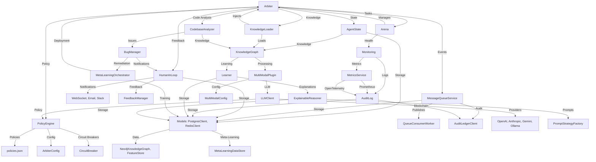

<!-- Copyright © 2025 Novatrax Labs LLC. All Rights Reserved. -->

```mermaid
graph TD
    A[Arbiter] -->|Tasks| B[Arena]
    A -->|State| C[AgentState]
    A -->|Knowledge| D[KnowledgeLoader]
    A -->|Policy| E[PolicyEngine]
    A -->|Events| F[MessageQueueService]
    A -->|Feedback| G[HumanInLoop]
    A -->|Code Analysis| H[CodebaseAnalyzer]

    B -->|Manages| A
    B -->|Health| I[Monitoring]

    C -->|Storage| J[Models: PostgresClient, RedisClient]
    C -->|Knowledge| K[KnowledgeGraph]

    D -->|Injects| A
    D -->|Loads| K

    E -->|Policies| L[policies.json]
    E -->|Config| M[ArbiterConfig]
    E -->|Circuit Breakers| N[CircuitBreaker]

    F -->|Publishes| O[QueueConsumerWorker]
    F -->|Storage| J
    F -->|Audit| P[AuditLedgerClient]

    G -->|Notifications| Q[WebSocket, Email, Slack]
    G -->|Feedback| R[FeedbackManager]
    G -->|Storage| J

    H -->|Issues| S[BugManager]
    H -->|Knowledge| K

    I -->|Metrics| T[MetricsService]
    I -->|Logs| U[AuditLog]

    J -->|Data| V[Neo4jKnowledgeGraph, FeatureStore]
    J -->|Meta-Learning| W[MetaLearningDataStore]

    K -->|Processing| X[MultiModalPlugin]
    K -->|Learning| Y[Learner]

    S -->|Remediation| Z[MetaLearningOrchestrator]
    S -->|Notifications| G

    T -->|Prometheus| U
    T -->|OpenTelemetry| U

    U -->|Storage| J
    U -->|Blockchain| P

    X -->|LLM| AA[LLMClient]
    X -->|Config| AB[MultiModalConfig]

    Y -->|Explanations| AC[ExplainableReasoner]
    Y -->|Storage| J

    Z -->|Training| J
    Z -->|Deployment| A

    AA -->|Providers| AD[OpenAI, Anthropic, Gemini, Ollama]
    AA -->|Policy| E

    AC -->|Prompts| AE[PromptStrategyFactory]
    AC -->|Storage| J
```