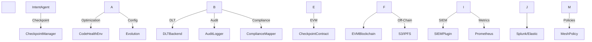

<!-- Copyright © 2025 Novatrax Labs LLC. All Rights Reserved. -->

\# EVM Chaincode Module - Self-Fixing Engineer (SFE) 🚀  

EVM Chaincode v1.0.0 - The "Immutable Anchor" Edition  

\*\*Proprietary Technology by Novatrax Labs\*\*


Secure your SFE workflows with tamper-evident checkpointing on EVM blockchains.


The EVM Chaincode module is the Ethereum Virtual Machine (EVM)-based checkpointing backbone of the Self-Fixing Engineer (SFE) platform, providing a tamper-evident, versioned ledger for storing checkpoint data. Implemented in `CheckpointContract.sol`, it supports secure, distributed state persistence for SFE workflows, integrating with mesh, guardrails, intent\_agent, plugins, fabric\_chaincode, and envs modules for audit logging, compliance, and optimization.


Crafted with precision in Fairhope, Alabama, USA.  

Anchor your SFE state with EVM Chaincode’s immutable checkpointing.


---


\## Table of Contents


\- \[Features](#features)

\- \[Architecture](#architecture)

\- \[Getting Started](#getting-started)

&nbsp; - \[Prerequisites](#prerequisites)

&nbsp; - \[Installation](#installation)

&nbsp; - \[Deployment](#deployment)

&nbsp; - \[Configuration](#configuration)

\- \[Usage](#usage)

&nbsp; - \[Writing Checkpoints](#writing-checkpoints)

&nbsp; - \[Reading Checkpoints](#reading-checkpoints)

&nbsp; - \[Rolling Back Checkpoints](#rolling-back-checkpoints)

\- \[Extending EVM Chaincode](#extending-evm-chaincode)

&nbsp; - \[Custom Contract Functions](#custom-contract-functions)

&nbsp; - \[Additional DLT Backends](#additional-dlt-backends)

\- \[Key Components](#key-components)

\- \[Tests](#tests)

\- \[Troubleshooting](#troubleshooting)

\- \[Best Practices](#best-practices)

\- \[Contribution Guidelines](#contribution-guidelines)

\- \[Roadmap](#roadmap)

\- \[Support](#support)

\- \[License](#license)


---


\## Features


The EVM Chaincode module delivers enterprise-grade checkpointing:


\- \*\*Tamper-Evident Checkpointing:\*\*

&nbsp; - Hash-chained `CheckpointEntry` with EVM events (`CheckpointContract.sol`)

&nbsp; - Secondary indexing for data hash lookups

\- \*\*Scalable Storage:\*\*

&nbsp; - On-chain metadata and off-chain payloads (S3, IPFS via `dlt\_backend`)

&nbsp; - Versioned checkpoints with logical rollback support

\- \*\*Compliance:\*\*

&nbsp; - Integrates with `compliance\_mapper.py` for NIST 800-53 controls

&nbsp; - Audit events logged via `audit\_log.py`

\- \*\*Observability:\*\*

&nbsp; - SIEM logging (`siem\_plugin`) for audit trails

&nbsp; - Prometheus metrics for contract health and operations

\- \*\*Security:\*\*

&nbsp; - Enforces writer attribution via `msg.sender`

&nbsp; - Hash chaining for integrity

\- \*\*Extensibility:\*\*

&nbsp; - Supports custom metadata in `CheckpointEntry`

&nbsp; - Pluggable off-chain storage via `dlt\_backend`


---


\## Architecture


The EVM Chaincode module integrates with SFE for secure checkpointing:





\*\*Workflow:\*\*

\- \*\*Checkpointing:\*\* `intent\_agent` or `envs` modules call `checkpoint.py` to save state

\- \*\*DLT Storage:\*\* `dlt\_backend` invokes `CheckpointContract.sol` on EVM

\- \*\*Audit Logging:\*\* Events logged via `audit\_log.py` to SIEM (`siem\_plugin`)

\- \*\*Compliance:\*\* `compliance\_mapper.py` validates controls against `crew\_config.yaml`

\- \*\*Observability:\*\* Metrics exposed to Prometheus; notifications via `slack\_plugin`


\*\*Key Principles:\*\*

\- Security: Hash chaining and event emissions for integrity

\- Compliance: NIST control alignment

\- Scalability: On-chain metadata, off-chain payloads

\- Extensibility: Custom metadata and storage backends


---


\## Getting Started


\### Prerequisites


\- Solidity 0.8+ (for contract development)

\- Ethereum Node (e.g., Geth, OpenEthereum, or Infura RPC)

\- Hardhat/Truffle (for contract compilation and deployment)

\- Python 3.8+ (for SFE integration)

\- Docker (optional, for node setup)

\- Dependencies (Solidity):  

&nbsp; OpenZeppelin Contracts (@openzeppelin/contracts)

\- Dependencies (Python, for SFE):  

&nbsp; web3, pydantic, pyyaml, prometheus\_client, opentelemetry-sdk

\- Configuration: EVM network config, `dlt\_config.yaml`, `.env`

\- Secrets: Environment variables for EVM credentials and off-chain storage


\### Installation


1\. \*\*Clone the Repository:\*\*

&nbsp;   ```bash

&nbsp;   git clone <enterprise-repo-url>

&nbsp;   cd sfe/evm\_chaincode

&nbsp;   ```


2\. \*\*Set Up Hardhat Project:\*\*

&nbsp;   ```bash

&nbsp;   npm init -y

&nbsp;   npm install --save-dev hardhat @openzeppelin/contracts

&nbsp;   npx hardhat init

&nbsp;   ```


3\. \*\*Copy Contract:\*\*

&nbsp;   ```bash

&nbsp;   cp CheckpointContract.sol contracts/

&nbsp;   ```


4\. \*\*Set Up Python Environment (for SFE integration):\*\*

&nbsp;   ```bash

&nbsp;   cd ../

&nbsp;   python -m venv .venv

&nbsp;   source .venv/bin/activate

&nbsp;   pip install web3 pydantic pyyaml prometheus\_client opentelemetry-sdk

&nbsp;   ```


5\. \*\*Verify Setup:\*\*

&nbsp;   ```bash

&nbsp;   npx hardhat compile

&nbsp;   python -m plugins.dlt\_backend --health evm

&nbsp;   ```


---


\## Deployment


\### Configure Hardhat (`hardhat.config.js`):

```js

module.exports = {

&nbsp; solidity: "0.8.0",

&nbsp; networks: {

&nbsp;   local: {

&nbsp;     url: "http://localhost:8545",

&nbsp;     accounts: \["your\_private\_key"]

&nbsp;   }

&nbsp; }

};

```


\### Deploy Contract:

```bash

npx hardhat run scripts/deploy.js --network local

```


\*\*Example scripts/deploy.js:\*\*

```js

const hre = require("hardhat");


async function main() {

&nbsp; const CheckpointContract = await hre.ethers.getContractFactory("CheckpointContract");

&nbsp; const contract = await CheckpointContract.deploy();

&nbsp; await contract.deployed();

&nbsp; console.log("CheckpointContract deployed to:", contract.address);

}


main().catch((error) => {

&nbsp; console.error(error);

&nbsp; process.exitCode = 1;

});

```


\### Verify Deployment:

```bash

npx hardhat run scripts/invoke.js --network local

```


\*\*Example scripts/invoke.js:\*\*

```js

const hre = require("hardhat");


async function main() {

&nbsp; const contract = await hre.ethers.getContractAt("CheckpointContract", "contract\_address");

&nbsp; const health = await contract.getLatestCheckpoint("test\_checkpoint");

&nbsp; console.log("Health check:", health);

}


main().catch((error) => {

&nbsp; console.error(error);

&nbsp; process.exitCode = 1;

});

```


---


\## Configuration


Create `dlt\_config.yaml` in `sfe/config`:

```yaml

dlt\_type: evm

evm:

&nbsp; rpc\_url: http://localhost:8545

&nbsp; chain\_id: 1337

&nbsp; contract\_address: 0xYourContractAddress

&nbsp; contract\_abi\_path: ./artifacts/contracts/CheckpointContract.sol/CheckpointContract.json

&nbsp; private\_key: your\_private\_key

```


Set up `.env` for secrets:

```

ETHEREUM\_RPC=http://localhost:8545

ETHEREUM\_PRIVATE\_KEY=your\_private\_key

S3\_BUCKET\_NAME=your-bucket

AWS\_ACCESS\_KEY\_ID=your\_aws\_key

```


---


\## Usage


\### Writing Checkpoints


\- \*\*Invoke via Python (`dlt\_backend`):\*\*

&nbsp;   ```python

&nbsp;   from plugins.dlt\_backend import EVMDLTClient

&nbsp;   import json


&nbsp;   client = EVMDLTClient(config={

&nbsp;       "dlt\_type": "evm",

&nbsp;       "evm": {

&nbsp;           "rpc\_url": "http://localhost:8545",

&nbsp;           "contract\_address": "0xYourContractAddress",

&nbsp;           "contract\_abi\_path": "./artifacts/contracts/CheckpointContract.sol/CheckpointContract.json"

&nbsp;       }

&nbsp;   })

&nbsp;   await client.write\_checkpoint(

&nbsp;       checkpoint\_name="my\_checkpoint",

&nbsp;       hash="0xabc123",

&nbsp;       prev\_hash="0x0",

&nbsp;       metadata={"agent\_id": "sfe\_core"},

&nbsp;       payload\_blob=json.dumps({"data": "example"}).encode()

&nbsp;   )

&nbsp;   ```


\### Reading Checkpoints


\- \*\*Read latest checkpoint:\*\*

&nbsp;   ```js

&nbsp;   const ethers = require("ethers");

&nbsp;   const provider = new ethers.providers.JsonRpcProvider("http://localhost:8545");

&nbsp;   const contract = new ethers.Contract("0xYourContractAddress", abi, provider);

&nbsp;   const checkpoint = await contract.getLatestCheckpoint("my\_checkpoint");

&nbsp;   console.log(checkpoint);

&nbsp;   ```


\- \*\*Read by version:\*\*

&nbsp;   ```js

&nbsp;   const checkpoint = await contract.readCheckpoint("my\_checkpoint", 123456);

&nbsp;   console.log(checkpoint);

&nbsp;   ```


\- \*\*Read by hash:\*\*

&nbsp;   ```js

&nbsp;   const checkpoint = await contract.getCheckpointByHash("my\_checkpoint", "0xabc123");

&nbsp;   console.log(checkpoint);

&nbsp;   ```


\### Rolling Back Checkpoints


\- \*\*Rollback to a previous hash:\*\*

&nbsp;   ```js

&nbsp;   const wallet = new ethers.Wallet("your\_private\_key", provider);

&nbsp;   const contractWithSigner = contract.connect(wallet);

&nbsp;   await contractWithSigner.rollbackCheckpoint("my\_checkpoint", "0xabc123", "Rollback for audit");

&nbsp;   ```


---


\## Extending EVM Chaincode


\### Custom Contract Functions


\- \*\*Add a new function to CheckpointContract.sol:\*\*

&nbsp;   ```solidity

&nbsp;   function customFunction(string calldata name, string calldata data) external returns (string memory) {

&nbsp;       emit CustomEvent(name, data);

&nbsp;       return "Custom result";

&nbsp;   }

&nbsp;   event CustomEvent(string indexed name, string data);

&nbsp;   ```


\- \*\*Recompile and redeploy:\*\*

&nbsp;   ```bash

&nbsp;   npx hardhat compile

&nbsp;   npx hardhat run scripts/deploy.js --network local

&nbsp;   ```


\### Additional DLT Backends


\- \*\*Extend dlt\_backend for Fabric or Corda:\*\*

&nbsp;   ```python

&nbsp;   class FabricDLTClient:

&nbsp;       async def write\_checkpoint(self, checkpoint\_name, hash, prev\_hash, metadata, payload\_blob, correlation\_id):

&nbsp;           # Implement Fabric chaincode call

&nbsp;           pass

&nbsp;   ```


\- \*\*Update dlt\_config.yaml:\*\*

&nbsp;   ```yaml

&nbsp;   dlt\_type: fabric

&nbsp;   fabric:

&nbsp;     channel\_name: mychannel

&nbsp;     chaincode\_name: checkpoint\_chaincode

&nbsp;   ```


---


\## Key Components


| Component              | Purpose                                               |

|------------------------|-------------------------------------------------------|

| CheckpointContract.sol | EVM smart contract for tamper-evident checkpointing   |


\*\*Related Modules:\*\*

\- mesh/checkpoint.py: Manages checkpoint operations in Python

\- guardrails/audit\_log.py: Logs audit events for contract operations

\- plugins/dlt\_backend: EVM client for contract interaction

\- plugins/siem\_plugin: SIEM logging for audit trails

\- fabric\_chaincode: Fabric-based checkpointing for multi-DLT support


\*\*Artifacts:\*\*

\- audit\_trail.log: Audit logs from contract operations

\- s3://your-bucket/checkpoints/: Off-chain payloads

\- metrics/: Prometheus metrics

\- artifacts/contracts/CheckpointContract.sol/CheckpointContract.json: Contract ABI


---


\## Tests


\*\*tests/test\_checkpoint\_contract.js (Assumed)\*\*


\- Coverage: writeCheckpoint, readCheckpoint, rollbackCheckpoint, hash chaining

\- Gaps: Edge-case testing for stale hash mappings, rollback conflicts

\- Run: `npx hardhat test`


\*\*Integration Tests\*\*


\- Test with EVM network:

&nbsp;   ```bash

&nbsp;   python -m pytest tests/test\_dlt\_backend.py --cov=plugins.dlt\_backend

&nbsp;   ```


\*\*Full Test Suite\*\*

```bash

npx hardhat test \&\& pytest --cov=plugins.dlt\_backend

```

\- Output: Coverage report in `coverage/` (Hardhat) and `htmlcov/index.html` (Python)


---


\## Troubleshooting


\- \*\*Contract Deployment Errors:\*\*  

&nbsp; Check Hardhat logs: `cat hardhat.log`  

&nbsp; Verify network config: `cat hardhat.config.js`

\- \*\*DLT Backend Issues:\*\*  

&nbsp; Test: `python -m plugins.dlt\_backend --health evm`  

&nbsp; Ensure contract\_abi\_path is correct in `dlt\_config.yaml`

\- \*\*Hash Mismatch:\*\*  

&nbsp; Verify chain integrity: `python -m guardrails.audit\_log selftest`  

&nbsp; Check off-chain storage: `aws s3 ls s3://your-bucket/checkpoints/`

\- \*\*Prometheus Metrics Missing:\*\*  

&nbsp; Install prometheus\_client: `pip install prometheus\_client`  

&nbsp; Check: `curl http://localhost:8001/metrics`


---


\## Best Practices


\- Secure EVM Network: Use HTTPS RPC and private keys in a secrets manager

\- Enable DLT: Deploy contract on a production EVM chain (e.g., Ethereum, Polygon)

\- Monitor Metrics: Set up Prometheus/Grafana for contract health

\- Validate Checkpoints: Verify hash chaining before rollback

\- Backup Off-Chain Data: Ensure S3/IPFS durability

\- Add Access Control: Implement onlyOwner or RBAC for production


---


\## Contribution Guidelines


\- \*\*Code Style:\*\* Follow Solidity style guide; use solhint

\- \*\*Testing:\*\* Add tests in `tests/` for new contract functions

\- \*\*Documentation:\*\* Update `dlt\_config.yaml` and contract comments

\- \*\*Pull Requests:\*\* Ensure `npx hardhat test` and `pytest` achieve 90%+ coverage


---


\## Roadmap


\- Access Control: Add role-based access to CheckpointContract.sol

\- Multi-DLT Support: Enhance dlt\_backend for Corda integration

\- Grok 3 Integration: Use xAI’s Grok 3 for metadata analysis

\- Index Optimization: Clean up stale hash mappings

\- Compliance Enhancements: Map additional NIST controls via compliance\_mapper.py


---


\## Support


Contact Novatrax Labs’ support at \*\*support@novatraxlabs.com\*\*  

File issues at `<enterprise-repo-url>/issues` (enterprise access required)


---


\## License


\*\*Proprietary and Confidential © 2025 Novatrax Labs. All rights reserved.\*\*


EVM Chaincode and Self-Fixing Engineer™ are proprietary technologies.  

Unauthorized copying, distribution, reverse engineering, or use is strictly prohibited.  

For commercial licensing or evaluation inquiries, contact \*\*support@novatraxlabs.com\*\*.


Secure your SFE state with EVM Chaincode’s immutable checkpointing.

