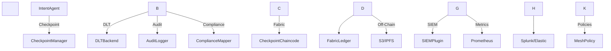

<!-- Copyright © 2025 Novatrax Labs LLC. All Rights Reserved. -->

\# Fabric Chaincode Module - Self-Fixing Engineer (SFE) 🚀  

Fabric Chaincode v1.0.0 - The "Immutable Ledger" Edition  

\*\*Proprietary Technology by Novatrax Labs\*\*


Secure your SFE workflows with tamper-evident checkpointing on Hyperledger Fabric.


The Fabric Chaincode module is the Hyperledger Fabric-based checkpointing backbone of the Self-Fixing Engineer (SFE) platform, providing a tamper-evident, versioned ledger for storing checkpoint data. Implemented in `checkpoint\_chaincode.go`, it supports secure, distributed state persistence for SFE workflows, integrating with mesh, guardrails, intent\_agent, and plugins modules for audit logging, compliance, and observability.


Crafted with precision in Fairhope, Alabama, USA.  

Anchor your SFE state with Fabric Chaincode’s immutable ledger.


---


\## Table of Contents


\- \[Features](#features)

\- \[Architecture](#architecture)

\- \[Getting Started](#getting-started)

&nbsp; - \[Prerequisites](#prerequisites)

&nbsp; - \[Installation](#installation)

&nbsp; - \[Deployment](#deployment)

&nbsp; - \[Configuration](#configuration)

\- \[Usage](#usage)

&nbsp; - \[Writing Checkpoints](#writing-checkpoints)

&nbsp; - \[Reading Checkpoints](#reading-checkpoints)

&nbsp; - \[Rolling Back Checkpoints](#rolling-back-checkpoints)

\- \[Extending Fabric Chaincode](#extending-fabric-chaincode)

&nbsp; - \[Custom Chaincode Functions](#custom-chaincode-functions)

&nbsp; - \[Additional DLT Backends](#additional-dlt-backends)

\- \[Key Components](#key-components)

\- \[Tests](#tests)

\- \[Troubleshooting](#troubleshooting)

\- \[Best Practices](#best-practices)

\- \[Contribution Guidelines](#contribution-guidelines)

\- \[Roadmap](#roadmap)

\- \[Support](#support)

\- \[License](#license)


---


\## Features


The Fabric Chaincode module delivers enterprise-grade checkpointing:


\- \*\*Tamper-Evident Checkpointing:\*\*

&nbsp; - Hash-chained `CheckpointEntry` with Fabric client identity (`checkpoint\_chaincode.go`)

&nbsp; - Secondary indexing for data hash lookups

\- \*\*Scalable Storage:\*\*

&nbsp; - On-chain metadata and off-chain payloads (S3, IPFS via `dlt\_backend`)

&nbsp; - Versioned checkpoints with rollback support

\- \*\*Compliance:\*\*

&nbsp; - Integrates with `compliance\_mapper.py` for NIST 800-53 controls

&nbsp; - Audit events logged via `audit\_log.py`

\- \*\*Observability:\*\*

&nbsp; - SIEM logging (`siem\_plugin`) for audit trails

&nbsp; - Prometheus metrics for chaincode health and operations

\- \*\*Security:\*\*

&nbsp; - Enforces writer identity via Fabric MSP

&nbsp; - Hash chaining for integrity

\- \*\*Extensibility:\*\*

&nbsp; - Supports custom metadata in `CheckpointEntry`

&nbsp; - Pluggable off-chain storage via `dlt\_backend`


---


\## Architecture


The Fabric Chaincode module integrates with SFE for secure checkpointing:





\*\*Workflow:\*\*

\- \*\*Checkpointing:\*\* `intent\_agent` or `mesh` modules call `checkpoint.py` to save state

\- \*\*DLT Storage:\*\* `dlt\_backend` invokes `checkpoint\_chaincode.go` on Fabric

\- \*\*Audit Logging:\*\* Events are logged via `audit\_log.py` to SIEM (`siem\_plugin`)

\- \*\*Compliance:\*\* `compliance\_mapper.py` validates controls against `crew\_config.yaml`

\- \*\*Observability:\*\* Metrics exposed to Prometheus; notifications via `slack\_plugin`


\*\*Key Principles:\*\*

\- Security: Hash chaining and client identity for integrity

\- Compliance: NIST control alignment

\- Scalability: On-chain metadata, off-chain payloads

\- Extensibility: Custom metadata and storage backends


---


\## Getting Started


\### Prerequisites


\- Go 1.18+ (for chaincode development)

\- Hyperledger Fabric 2.5+ (network and CLI tools)

\- Python 3.8+ (for SFE integration)

\- Docker (for chaincode deployment)

\- Dependencies (Go modules):

&nbsp; - github.com/hyperledger/fabric-chaincode-go

&nbsp; - github.com/hyperledger/fabric-contract-api-go

&nbsp; - github.com/hyperledger/fabric-protos-go

\- Dependencies (Python, for SFE):

&nbsp; - hfc, pydantic, pyyaml, prometheus\_client, opentelemetry-sdk

\- Configuration: Fabric network profile, `dlt\_config.yaml`, `.env`

\- Secrets: Environment variables for Fabric credentials and off-chain storage


\### Installation


1\. \*\*Clone the Repository:\*\*

&nbsp;   ```bash

&nbsp;   git clone <enterprise-repo-url>

&nbsp;   cd sfe/fabric\_chaincode

&nbsp;   ```


2\. \*\*Install Go Dependencies:\*\*

&nbsp;   ```bash

&nbsp;   go mod init checkpoint\_chaincode

&nbsp;   go get github.com/hyperledger/fabric-chaincode-go

&nbsp;   go get github.com/hyperledger/fabric-contract-api-go

&nbsp;   go get github.com/hyperledger/fabric-protos-go

&nbsp;   ```


3\. \*\*Set Up Python Environment (for SFE integration):\*\*

&nbsp;   ```bash

&nbsp;   cd ../

&nbsp;   python -m venv .venv

&nbsp;   source .venv/bin/activate

&nbsp;   pip install hfc pydantic pyyaml prometheus\_client opentelemetry-sdk

&nbsp;   ```


4\. \*\*Verify Setup:\*\*

&nbsp;   ```bash

&nbsp;   go build checkpoint\_chaincode.go

&nbsp;   python -m plugins.dlt\_backend --health fabric

&nbsp;   ```


---


\## Deployment


\### Set Up Fabric Network


\- Deploy a Fabric network (e.g., using test-network from Fabric samples)

\- Configure peers, orderers, and channels in `network.json`


\### Package Chaincode


```bash

mkdir -p chaincode\_package

cp checkpoint\_chaincode.go chaincode\_package/

cd chaincode\_package

tar -czf code.tar.gz checkpoint\_chaincode.go

tar -czf checkpoint\_chaincode.tar.gz code.tar.gz metadata.json

```


\*\*Example metadata.json:\*\*

```json

{

&nbsp; "type": "ccaas",

&nbsp; "label": "checkpoint\_chaincode\_v1"

}

```


\### Install and Approve Chaincode


```bash

peer chaincode install checkpoint\_chaincode.tar.gz

peer chaincode approveformyorg -o orderer.example.com:7050 --channelID mychannel --name checkpoint\_chaincode --version 1.0 --package-id <package-id> --sequence 1

```


\### Commit Chaincode


```bash

peer chaincode commit -o orderer.example.com:7050 --channelID mychannel --name checkpoint\_chaincode --version 1.0 --sequence 1

```


\### Verify Deployment


```bash

peer chaincode invoke -o orderer.example.com:7050 -C mychannel -n checkpoint\_chaincode -c '{"function":"HealthCheck","Args":\[]}'

```


---


\## Configuration


Create `dlt\_config.yaml` in `sfe/config`:

```yaml

dlt\_type: fabric

fabric:

&nbsp; channel\_name: mychannel

&nbsp; chaincode\_name: checkpoint\_chaincode

&nbsp; org\_name: Org1

&nbsp; user\_name: user1

&nbsp; network\_profile\_path: ./network.json

&nbsp; peer\_names: \["peer0.org1.example.com"]

```


Set up `.env` for secrets:

```

FABRIC\_CHANNEL=mychannel

FABRIC\_CHAINCODE=checkpoint\_chaincode

S3\_BUCKET\_NAME=your-bucket

AWS\_ACCESS\_KEY\_ID=your\_aws\_key

```


---


\## Usage


\### Writing Checkpoints


\- \*\*Invoke via Python (`dlt\_backend`):\*\*

&nbsp;   ```python

&nbsp;   from plugins.dlt\_backend import ProductionDLTClient

&nbsp;   import json


&nbsp;   client = ProductionDLTClient(config={"dlt\_type": "fabric", "fabric": {...}})

&nbsp;   await client.write\_checkpoint(

&nbsp;       checkpoint\_name="my\_checkpoint",

&nbsp;       hash="sha256:abc123",

&nbsp;       prev\_hash="",

&nbsp;       metadata={"agent\_id": "sfe\_core"},

&nbsp;       payload\_blob=json.dumps({"data": "example"}).encode()

&nbsp;   )

&nbsp;   ```


\### Reading Checkpoints


\- \*\*Read latest checkpoint:\*\*

&nbsp;   ```bash

&nbsp;   peer chaincode invoke -o orderer.example.com:7050 -C mychannel -n checkpoint\_chaincode -c '{"function":"ReadCheckpoint","Args":\["my\_checkpoint"]}'

&nbsp;   ```


\- \*\*Read by version:\*\*

&nbsp;   ```bash

&nbsp;   peer chaincode invoke -o orderer.example.com:7050 -C mychannel -n checkpoint\_chaincode -c '{"function":"ReadCheckpoint","Args":\["my\_checkpoint", "1"]}'

&nbsp;   ```


\- \*\*Read by hash:\*\*

&nbsp;   ```bash

&nbsp;   peer chaincode invoke -o orderer.example.com:7050 -C mychannel -n checkpoint\_chaincode -c '{"function":"ReadCheckpointByHash","Args":\["my\_checkpoint", "sha256:abc123"]}'

&nbsp;   ```


\### Rolling Back Checkpoints


\- \*\*Rollback to a previous hash:\*\*

&nbsp;   ```bash

&nbsp;   peer chaincode invoke -o orderer.example.com:7050 -C mychannel -n checkpoint\_chaincode -c '{"function":"RollbackCheckpoint","Args":\["my\_checkpoint", "sha256:abc123", "Rollback for audit"]}'

&nbsp;   ```


---


\## Extending Fabric Chaincode


\### Custom Chaincode Functions


\- \*\*Add a new function to `checkpoint\_chaincode.go`:\*\*

&nbsp;   ```go

&nbsp;   func (s \*SmartContract) CustomFunction(ctx contractapi.TransactionContextInterface, arg string) (string, error) {

&nbsp;       logger.Infof("CustomFunction invoked with arg: %s", arg)

&nbsp;       return "Custom result", nil

&nbsp;   }

&nbsp;   ```


\- \*\*Update chaincode and redeploy:\*\*

&nbsp;   ```bash

&nbsp;   peer chaincode install checkpoint\_chaincode.tar.gz

&nbsp;   peer chaincode upgrade -o orderer.example.com:7050 -C mychannel -n checkpoint\_chaincode --version 1.1 --sequence 2

&nbsp;   ```


\### Additional DLT Backends


\- \*\*Extend `dlt\_backend` for Ethereum or Corda:\*\*

&nbsp;   ```python

&nbsp;   class EthereumDLTClient:

&nbsp;       async def write\_checkpoint(self, checkpoint\_name, hash, prev\_hash, metadata, payload\_blob, correlation\_id):

&nbsp;           # Implement Ethereum contract call

&nbsp;           pass

&nbsp;   ```


\- \*\*Update `dlt\_config.yaml`:\*\*

&nbsp;   ```yaml

&nbsp;   dlt\_type: evm

&nbsp;   evm:

&nbsp;     rpc\_url: https://rpc.ethereum.org

&nbsp;     contract\_address: 0x...

&nbsp;   ```


---


\## Key Components


| Component                | Purpose                                               |

|--------------------------|-------------------------------------------------------|

| checkpoint\_chaincode.go  | Fabric chaincode for tamper-evident checkpointing     |


\*\*Related Modules:\*\*

\- mesh/checkpoint.py: Manages checkpoint operations in Python

\- guardrails/audit\_log.py: Logs audit events for chaincode operations

\- plugins/dlt\_backend: Fabric client for chaincode interaction

\- plugins/siem\_plugin: SIEM logging for audit trails


\*\*Artifacts:\*\*

\- audit\_trail.log: Audit logs from chaincode operations

\- s3://your-bucket/checkpoints/: Off-chain payloads

\- metrics/: Prometheus metrics


---


\## Tests


\*\*tests/test\_checkpoint\_chaincode.go (Assumed)\*\*


\- Coverage: WriteCheckpoint, ReadCheckpoint, RollbackCheckpoint, hash chaining

\- Gaps: Edge-case testing for stale indexes, rollback conflicts

\- Run: `go test ./tests -v`


\*\*Integration Tests\*\*


\- Test with Fabric network:

&nbsp;   ```bash

&nbsp;   python -m pytest tests/test\_dlt\_backend.py --cov=plugins.dlt\_backend

&nbsp;   ```


\*\*Full Test Suite\*\*

```bash

go test ./... \&\& pytest --cov=plugins.dlt\_backend

```

\- Output: Coverage report in `cover.out` (Go) and `htmlcov/index.html` (Python)


---


\## Troubleshooting


\- \*\*Chaincode Errors:\*\*  

&nbsp; Check Fabric peer logs: `docker logs peer0.org1.example.com`  

&nbsp; Verify chaincode deployment: `peer chaincode list --installed`

\- \*\*DLT Backend Issues:\*\*  

&nbsp; Test: `python -m plugins.dlt\_backend --health fabric`  

&nbsp; Ensure `network.json` is correct

\- \*\*Hash Mismatch:\*\*  

&nbsp; Verify chain integrity: `python -m guardrails.audit\_log selftest`  

&nbsp; Check off-chain storage (`s3://your-bucket`)

\- \*\*Prometheus Metrics Missing:\*\*  

&nbsp; Install prometheus\_client: `pip install prometheus\_client`  

&nbsp; Check: `curl http://localhost:8001/metrics`


---


\## Best Practices


\- Secure Fabric Network: Use TLS and MSP for client authentication

\- Enable DLT: Deploy chaincode on a production Fabric network

\- Monitor Metrics: Set up Prometheus/Grafana for chaincode health

\- Validate Checkpoints: Verify hash chaining before rollback

\- Backup Off-Chain Data: Ensure S3/IPFS durability


---


\## Contribution Guidelines


\- \*\*Code Style:\*\* Follow Go conventions; use gofmt and golint

\- \*\*Testing:\*\* Add tests in `tests/` for new chaincode functions

\- \*\*Documentation:\*\* Update `network.json` and `dlt\_config.yaml`

\- \*\*Pull Requests:\*\* Ensure `go test` and `pytest` achieve 90%+ coverage


---


\## Roadmap


\- Additional Chaincode Functions: Add querying by metadata

\- Multi-DLT Support: Integrate with Ethereum/Corda via `dlt\_backend`

\- Grok 3 Integration: Use xAI’s Grok 3 for metadata analysis

\- Index Optimization: Clean up stale secondary indexes

\- Compliance Enhancements: Map additional NIST controls


---


\## Support


Contact Novatrax Labs’ support at \*\*support@novatraxlabs.com\*\*  

File issues at `<enterprise-repo-url>/issues` (enterprise access required)


---


\## License


\*\*Proprietary and Confidential © 2025 Novatrax Labs. All rights reserved.\*\*


Fabric Chaincode and Self-Fixing Engineer™ are proprietary technologies.  

Unauthorized copying, distribution, reverse engineering, or use is strictly prohibited.  

For commercial licensing or evaluation inquiries, contact \*\*support@novatraxlabs.com\*\*.


Secure your SFE state with Fabric Chaincode’s immutable checkpointing.

