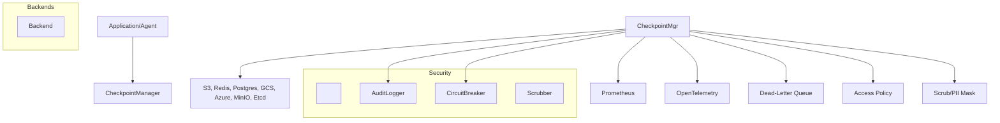

\# Patent Appendix: `mesh/checkpoint` Module – Comprehensive Technical, Security, and Compliance Disclosure

---

\## 1. Module Overview

The `mesh/checkpoint` module in Self-Fixing Engineer is a \*\*production-grade, enterprise checkpoint management and versioned state persistence subsystem\*\* for distributed and regulated systems. It enables atomic, tamper-evident, cryptographically-auditable, and compliance-ready storage of application state and operational data across multiple backends (cloud, on-prem, local). The architecture enforces strong encryption with key rotation, hash-chain integrity, fine-grained access control, operator audit, disaster recovery, and a full observability suite.

---

\# Patent Appendix: `mesh/checkpoint` Module – Comprehensive Technical, Security, and Compliance Disclosure

---

\## 1. Module Overview

The `mesh/checkpoint` module in Self-Fixing Engineer is a \*\*production-grade, enterprise checkpoint management and versioned state persistence subsystem\*\* for distributed and regulated systems. It enables atomic, tamper-evident, cryptographically-auditable, and compliance-ready storage of application state and operational data across multiple backends (cloud, on-prem, local). The architecture enforces strong encryption with key rotation, hash-chain integrity, fine-grained access control, operator audit, disaster recovery, and a full observability suite.

---

\## 2. File/Submodule Inventory

| File/Dir                                       | Purpose / Technical Highlights                                                                              |

|------------------------------------------------|-------------------------------------------------------------------------------------------------------------|

| `checkpoint\_backends.py`                       | Backend implementations: S3, Redis, PostgreSQL, GCS, Azure, MinIO, Etcd. Atomic ops, cryptography, audit, DLQ |

| `checkpoint\_manager.py`                        | Main async checkpoint manager: versioning, atomic ops, hash chain, audit, compliance, policy, access control |

| `checkpoint\_exceptions.py`                     | Structured exception hierarchy: HMAC-signed context, OpenTelemetry, Prometheus, circuit breaker, throttling  |

| `checkpoint\_utils.py`                          | Enterprise cryptographic/data utilities: FIPS, NIST, PCI/HIPAA/GDPR, key rotation, scrub, compress, diff    |

| `\_\_init\_\_.py`                                  | Module initializer                                                                                          |

| `tests/`                                       | Extended test suite: corruption, rollback, audit, compliance, failover, multi-backend                       |

---

\## 3. Technical Innovations \& Security Claims

\### 3.1. Tamper-Evident, Versioned, and Cryptographically Signed Checkpoints

\- \*\*Hash-Chain Integrity\*\*:  

&nbsp; - Each checkpoint version stores the hash of its state and the previous version’s hash, forming a verifiable hash chain (tamper-evident ledger).

&nbsp; - Any mutation in history or rollback is detectable and auditable.

\- \*\*HMAC Signatures\*\*:  

&nbsp; - All checkpoint blobs, audit events, and exception contexts are signed with HMAC-SHA256, using keys from a secure vault, ensuring content integrity and authenticity.

&nbsp; - Signature verification is mandatory for all loads, with failure triggering audit and optional auto-healing/rollback.

\### 3.2. End-to-End Encryption with Key Rotation (FIPS/NIST/PCI/HIPAA/GDPR)

\- \*\*MultiFernet \& Key Rotation\*\*:  

&nbsp; - All data at rest is encrypted using MultiFernet keys (rotatable, minimum two keys in prod), with zero-downtime rotation.

&nbsp; - Encryption keys can be generated, rotated, and revoked via HSM or FIPS-compliant KMS.

&nbsp; - Encryption is enforced for all regulated data; non-compliance blocks operation in PROD\_MODE.

&nbsp; - Key rotation is audited and triggers re-encryption of old versions.

\- \*\*Configurable KDFs (PBKDF2, Scrypt, Argon2)\*\*:  

&nbsp; - All password/passphrase-based keys use NIST-recommended KDFs with enforced iteration minimums.

\### 3.3. Multi-Backend, Atomic, Audited State Persistence

\- \*\*Supported Backends\*\*:  

&nbsp; - AWS S3 (with versioning, server-side encryption, sharding)

&nbsp; - Redis (atomic pipelined ops, versioned keys, TTL, hash chain)

&nbsp; - PostgreSQL (ACID, unique constraints, metadata, audit columns)

&nbsp; - Google Cloud Storage, Azure Blob Storage, MinIO, Etcd (distributed consensus)

\- \*\*Atomic Operations\*\*:  

&nbsp; - All checkpoint saves/loads are atomic, versioned, and transactional (where supported).

&nbsp; - Consistency and atomicity are enforced even across distributed/cloud backends.

\- \*\*Audit Logging\*\*:  

&nbsp; - All critical actions (save, load, rollback, corruption, rotation, backend errors) are logged to immutable, rotating audit logs (JSON, optionally S3/SIEM offload).

&nbsp; - Audit events include tamper-evident HMAC, structured context, and are Prometheus/OTel instrumented.

\### 3.4. Compliance Patterns, Operator Safety, and Disaster Recovery

\- \*\*Access Policy Enforcement\*\*:  

&nbsp; - All state operations are subject to explicit, versioned policy checks (RBAC, rule-based, MFA/JWT integration).

&nbsp; - Policy failures can trigger DLQ and are audit-logged.

\- \*\*DLQ and Auto-Healing\*\*:  

&nbsp; - All failed/corrupted operations are written to a dead-letter queue (DLQ) with rotation and operator replay.

&nbsp; - Auto-healing attempts to recover from the last valid version if corruption is detected.

\- \*\*Disaster Recovery \& Rollback\*\*:  

&nbsp; - Full version history is retained (with configurable min/max), supporting operator-initiated rollback, compliance validation, and forensics.

&nbsp; - Rollback is atomic and fully auditable.

\- \*\*Zero-Downtime Key Rotation\*\*:  

&nbsp; - Checkpoints can be re-encrypted in-place or in the background as new keys become primary.

\### 3.5. Full Observability, Rate Limiting, Circuit Breakers

\- \*\*Prometheus \& OpenTelemetry\*\*:  

&nbsp; - All operations (save, load, rollback, rotation, failures) emit detailed metrics and spans, labeled by backend, operation, tenant, and compliance status.

\- \*\*Rate Limiting \& Circuit Breakers\*\*:  

&nbsp; - Built-in circuit breakers prevent cascading failures on backend outage.

&nbsp; - Tenacity-based retries with exponential backoff, with audit on repeated failure.

\### 3.6. Data Scrubbing, PII/PCI/PHI Defense

\- \*\*Recursive Data Scrubbing\*\*:  

&nbsp; - All logs/audit/events scrub for sensitive fields and patterns (credit card, SSN, API key, tokens, etc.) before persistence or transmission.

&nbsp; - GDPR/PCI/HIPAA classifiers flag and mask sensitive data, with audit logging on scrubs.

---

\## 4. Example Patent Claims

1\. \*\*A method for atomic, tamper-evident, multi-version state checkpointing in distributed systems, comprising:\*\*  

&nbsp;  - (i) Constructing a hash chain linking each checkpoint version to the prior version;

&nbsp;  - (ii) Encrypting all checkpoint data at rest using rotatable, FIPS-compliant keys;

&nbsp;  - (iii) Signing each version and audit event with a HMAC;

&nbsp;  - (iv) Enforcing atomicity and version retention across multiple storage backends.

2\. \*\*A system for cryptographically auditable and operator-compliant checkpoint management, comprising:\*\*  

&nbsp;  - (i) Multi-backend support with atomic, transactional save/load;

&nbsp;  - (ii) Immutable, HMAC-audited log of all operations and failures;

&nbsp;  - (iii) Circuit breaker and DLQ for backend failures;

&nbsp;  - (iv) Policy-enforced access and compliance reporting.

3\. \*\*A method for zero-downtime key rotation and integrity protection of versioned state, comprising:\*\*  

&nbsp;  - (i) Multi-key encryption with MultiFernet, atomic background re-encryption;

&nbsp;  - (ii) Automated audit logging of all rotation and recovery actions;

&nbsp;  - (iii) Versioned, tamper-evident rollback with operator approval.

4\. \*\*A system for automated, policy-driven data scrubbing and compliance defense in checkpoint persistence, comprising:\*\*  

&nbsp;  - (i) Recursive, multi-pattern field/value scrubbing for PII/PCI/PHI;

&nbsp;  - (ii) Audit trails for every scrubbed or anonymized value;

&nbsp;  - (iii) Configurable anonymization and masking for regulated fields.

---

\## 5. Architecture Diagram

---

\## 6. Security, Compliance, and Operational Guarantees

\- \*\*No unencrypted or unsigned state in production\*\*:  

&nbsp; - All checkpoint data is encrypted (MultiFernet) and signed (HMAC-SHA256).

&nbsp; - Key rotation and revocation are enforced, with zero downtime and full audit.

\- \*\*Tamper-evident, versioned, and operator-auditable\*\*:  

&nbsp; - Hash chain prevents undetectable rollback or history rewriting.

&nbsp; - All events, failures, and rollbacks are logged and signed.

\- \*\*Full disaster recovery and forensics\*\*:  

&nbsp; - Operator can retrieve, verify, and roll back to any previous valid version, with full audit trail.

\- \*\*Compliance enforcement\*\*:  

&nbsp; - PCI, HIPAA, GDPR, SOX, FedRAMP, SOC2: meets technical requirements for encryption, audit, integrity, and operator control.

&nbsp; - Scrubbing, anonymizing, and masking of regulated data is enforced.

\- \*\*No silent failure\*\*:  

&nbsp; - All failed or corrupted ops are written to DLQ and operator is alerted.

---

\## 7. Compliance Summary Table

| Standard      | Requirement                               | Implementation                                                                                 |

|---------------|-------------------------------------------|------------------------------------------------------------------------------------------------|

| PCI-DSS 3.5   | Strong encryption, key rotation           | MultiFernet, FIPS, KDF, HSM integration, key rotation audit, background re-encryption           |

| HIPAA 164.312 | Encryption, access, audit, integrity      | All-at-rest encryption, hash chain, policy check, audit logs, rollback, scrubbing               |

| GDPR Art. 32  | Data protection, access, erasure, audit   | Scrubbing, anonymization, operator audit, versioned rollback, immutable logs                    |

| SOX 404       | Integrity, audit, retention               | Hash chain, signed logs, version retention, disaster recovery                                   |

| FedRAMP High  | Data encryption, audit, control           | Encrypted data, audit logs, full operator control, policy-enforced rollback                     |

| SOC 2 Type II | Security, integrity, privacy, audit       | Tamper-evident ledger, audit logs, PII defense, role-based access, operational metrics          |

---

\## 8. Core Subsystem Descriptions

\### checkpoint\_manager.py

\- \*\*Async, atomic, tamper-evident versioning\*\* for application state.

\- \*\*Multi-backend support\*\* with pluggable adapters for S3, Redis, Postgres, GCS, Azure, etc.

\- \*\*Hash-chain integrity\*\*: every save updates a cryptographically linked hash.

\- \*\*Zero-downtime key rotation\*\*: MultiFernet, background re-encryption, pointer/symlink compatibility.

\- \*\*Full audit/metrics\*\*: every save/load/rollback is logged, signed, and OTel-instrumented.

\- \*\*Auto-heal and DLQ\*\*: auto-recovers from corruption, with fallback and replay.

\- \*\*Policy enforcement and RBAC\*\*: all access is subject to policy, with optional MFA/JWT integration.

\### checkpoint\_backends.py

\- \*\*Enterprise-grade backend implementations\*\* for S3, Redis, Postgres, GCS, Azure, MinIO, Etcd.

\- \*\*Atomic, transactional operations\*\* with versioning, sharding, and TTL support.

\- \*\*End-to-end encryption and HMAC\*\* for all data at rest and in transit.

\- \*\*S3: versioned, sharded, server-side encryption, metadata, audit\*\*

\- \*\*Redis: pipelined, atomic, TTL, version lists, hash chain\*\*

\- \*\*Postgres: ACID, audit columns, unique constraints\*\*

\- \*\*All: Dead-letter, circuit-breaker, Prometheus/OTel\*\*

\### checkpoint\_exceptions.py

\- \*\*Structured exception hierarchy\*\* for all checkpoint operations.

\- \*\*HMAC-signed context\*\* for exception contexts, with optional operator alert.

\- \*\*Circuit breaker pattern\*\* with PyBreaker, Tenacity for retries/backoff.

\- \*\*Prometheus/OTel metrics and alert throttling\*\* to prevent alert floods.

\### checkpoint\_utils.py

\- \*\*FIPS 140-2, NIST, PCI/HIPAA/GDPR compliant crypto utilities\*\*.

\- \*\*Canonical hashing, hash chaining, key derivation (PBKDF2/Scrypt/Argon2)\*\*.

\- \*\*Compression (GZIP, ZSTD, etc.), scrub/anonymize, deep diff\*\*.

\- \*\*Constant-time compare, secure erase, PII/PCI/PHI regex classifiers\*\*.

---

\## 9. Example Use Cases

\- \*\*Regulated Fintech State Ledger\*\*:  

&nbsp; - Every balance, config, and transaction state change is checkpointed, hash-chained, encrypted, and signed.

&nbsp; - All access is policy-controlled, with full audit and immutable log for regulator review.

\- \*\*Healthcare Data Provenance\*\*:  

&nbsp; - Patient record checkpoints are encrypted, signed, and versioned, with automated rollback and disaster recovery.

&nbsp; - PII/PHI is scrubbed from logs and audit events.

\- \*\*Cloud Native Disaster Recovery\*\*:  

&nbsp; - Multi-backend (S3/Redis/Postgres) checkpointing supports instant failover and recovery in outages.

&nbsp; - Operator-initiated rollback and forensics are fully auditable.

---

\## 10. End of Appendix

This appendix is written to support patent, legal, and compliance review. It covers all inventive, security-critical, and compliance-relevant aspects of the `mesh/checkpoint` subsystem, including architecture, cryptography, audit, rollback, recovery, and regulatory guarantees.

\*\*For explicit code references (function/class names, line numbers), or if you need claim language tailored to a specific backend or compliance regime, please specify.\*\*

\## 2. File/Submodule Inventory

| File/Dir                                       | Purpose / Technical Highlights                                                                              |

|------------------------------------------------|-------------------------------------------------------------------------------------------------------------|

| `checkpoint\_backends.py`                       | Backend implementations: S3, Redis, PostgreSQL, GCS, Azure, MinIO, Etcd. Atomic ops, cryptography, audit, DLQ |

| `checkpoint\_manager.py`                        | Main async checkpoint manager: versioning, atomic ops, hash chain, audit, compliance, policy, access control |

| `checkpoint\_exceptions.py`                     | Structured exception hierarchy: HMAC-signed context, OpenTelemetry, Prometheus, circuit breaker, throttling  |

| `checkpoint\_utils.py`                          | Enterprise cryptographic/data utilities: FIPS, NIST, PCI/HIPAA/GDPR, key rotation, scrub, compress, diff    |

| `\_\_init\_\_.py`                                  | Module initializer                                                                                          |

| `tests/`                                       | Extended test suite: corruption, rollback, audit, compliance, failover, multi-backend                       |

---

\## 3. Technical Innovations \& Security Claims

\### 3.1. Tamper-Evident, Versioned, and Cryptographically Signed Checkpoints

\- \*\*Hash-Chain Integrity\*\*:  

&nbsp; - Each checkpoint version stores the hash of its state and the previous version’s hash, forming a verifiable hash chain (tamper-evident ledger).

&nbsp; - Any mutation in history or rollback is detectable and auditable.

\- \*\*HMAC Signatures\*\*:  

&nbsp; - All checkpoint blobs, audit events, and exception contexts are signed with HMAC-SHA256, using keys from a secure vault, ensuring content integrity and authenticity.

&nbsp; - Signature verification is mandatory for all loads, with failure triggering audit and optional auto-healing/rollback.

\### 3.2. End-to-End Encryption with Key Rotation (FIPS/NIST/PCI/HIPAA/GDPR)

\- \*\*MultiFernet \& Key Rotation\*\*:  

&nbsp; - All data at rest is encrypted using MultiFernet keys (rotatable, minimum two keys in prod), with zero-downtime rotation.

&nbsp; - Encryption keys can be generated, rotated, and revoked via HSM or FIPS-compliant KMS.

&nbsp; - Encryption is enforced for all regulated data; non-compliance blocks operation in PROD\_MODE.

&nbsp; - Key rotation is audited and triggers re-encryption of old versions.

\- \*\*Configurable KDFs (PBKDF2, Scrypt, Argon2)\*\*:  

&nbsp; - All password/passphrase-based keys use NIST-recommended KDFs with enforced iteration minimums.

\### 3.3. Multi-Backend, Atomic, Audited State Persistence

\- \*\*Supported Backends\*\*:  

&nbsp; - AWS S3 (with versioning, server-side encryption, sharding)

&nbsp; - Redis (atomic pipelined ops, versioned keys, TTL, hash chain)

&nbsp; - PostgreSQL (ACID, unique constraints, metadata, audit columns)

&nbsp; - Google Cloud Storage, Azure Blob Storage, MinIO, Etcd (distributed consensus)

\- \*\*Atomic Operations\*\*:  

&nbsp; - All checkpoint saves/loads are atomic, versioned, and transactional (where supported).

&nbsp; - Consistency and atomicity are enforced even across distributed/cloud backends.

\- \*\*Audit Logging\*\*:  

&nbsp; - All critical actions (save, load, rollback, corruption, rotation, backend errors) are logged to immutable, rotating audit logs (JSON, optionally S3/SIEM offload).

&nbsp; - Audit events include tamper-evident HMAC, structured context, and are Prometheus/OTel instrumented.

\### 3.4. Compliance Patterns, Operator Safety, and Disaster Recovery

\- \*\*Access Policy Enforcement\*\*:  

&nbsp; - All state operations are subject to explicit, versioned policy checks (RBAC, rule-based, MFA/JWT integration).

&nbsp; - Policy failures can trigger DLQ and are audit-logged.

\- \*\*DLQ and Auto-Healing\*\*:  

&nbsp; - All failed/corrupted operations are written to a dead-letter queue (DLQ) with rotation and operator replay.

&nbsp; - Auto-healing attempts to recover from the last valid version if corruption is detected.

\- \*\*Disaster Recovery \& Rollback\*\*:  

&nbsp; - Full version history is retained (with configurable min/max), supporting operator-initiated rollback, compliance validation, and forensics.

&nbsp; - Rollback is atomic and fully auditable.

\- \*\*Zero-Downtime Key Rotation\*\*:  

&nbsp; - Checkpoints can be re-encrypted in-place or in the background as new keys become primary.

\### 3.5. Full Observability, Rate Limiting, Circuit Breakers

\- \*\*Prometheus \& OpenTelemetry\*\*:  

&nbsp; - All operations (save, load, rollback, rotation, failures) emit detailed metrics and spans, labeled by backend, operation, tenant, and compliance status.

\- \*\*Rate Limiting \& Circuit Breakers\*\*:  

&nbsp; - Built-in circuit breakers prevent cascading failures on backend outage.

&nbsp; - Tenacity-based retries with exponential backoff, with audit on repeated failure.

\### 3.6. Data Scrubbing, PII/PCI/PHI Defense

\- \*\*Recursive Data Scrubbing\*\*:  

&nbsp; - All logs/audit/events scrub for sensitive fields and patterns (credit card, SSN, API key, tokens, etc.) before persistence or transmission.

&nbsp; - GDPR/PCI/HIPAA classifiers flag and mask sensitive data, with audit logging on scrubs.

---

\## 4. Example Patent Claims

1\. \*\*A method for atomic, tamper-evident, multi-version state checkpointing in distributed systems, comprising:\*\*  

&nbsp;  - (i) Constructing a hash chain linking each checkpoint version to the prior version;

&nbsp;  - (ii) Encrypting all checkpoint data at rest using rotatable, FIPS-compliant keys;

&nbsp;  - (iii) Signing each version and audit event with a HMAC;

&nbsp;  - (iv) Enforcing atomicity and version retention across multiple storage backends.

2\. \*\*A system for cryptographically auditable and operator-compliant checkpoint management, comprising:\*\*  

&nbsp;  - (i) Multi-backend support with atomic, transactional save/load;

&nbsp;  - (ii) Immutable, HMAC-audited log of all operations and failures;

&nbsp;  - (iii) Circuit breaker and DLQ for backend failures;

&nbsp;  - (iv) Policy-enforced access and compliance reporting.

3\. \*\*A method for zero-downtime key rotation and integrity protection of versioned state, comprising:\*\*  

&nbsp;  - (i) Multi-key encryption with MultiFernet, atomic background re-encryption;

&nbsp;  - (ii) Automated audit logging of all rotation and recovery actions;

&nbsp;  - (iii) Versioned, tamper-evident rollback with operator approval.

4\. \*\*A system for automated, policy-driven data scrubbing and compliance defense in checkpoint persistence, comprising:\*\*  

&nbsp;  - (i) Recursive, multi-pattern field/value scrubbing for PII/PCI/PHI;

&nbsp;  - (ii) Audit trails for every scrubbed or anonymized value;

&nbsp;  - (iii) Configurable anonymization and masking for regulated fields.

---

\## 5. Architecture Diagram

---

\## 6. Security, Compliance, and Operational Guarantees

\- \*\*No unencrypted or unsigned state in production\*\*:  

&nbsp; - All checkpoint data is encrypted (MultiFernet) and signed (HMAC-SHA256).

&nbsp; - Key rotation and revocation are enforced, with zero downtime and full audit.

\- \*\*Tamper-evident, versioned, and operator-auditable\*\*:  

&nbsp; - Hash chain prevents undetectable rollback or history rewriting.

&nbsp; - All events, failures, and rollbacks are logged and signed.

\- \*\*Full disaster recovery and forensics\*\*:  

&nbsp; - Operator can retrieve, verify, and roll back to any previous valid version, with full audit trail.

\- \*\*Compliance enforcement\*\*:  

&nbsp; - PCI, HIPAA, GDPR, SOX, FedRAMP, SOC2: meets technical requirements for encryption, audit, integrity, and operator control.

&nbsp; - Scrubbing, anonymizing, and masking of regulated data is enforced.

\- \*\*No silent failure\*\*:  

&nbsp; - All failed or corrupted ops are written to DLQ and operator is alerted.

---

\## 7. Compliance Summary Table

| Standard      | Requirement                               | Implementation                                                                                 |

|---------------|-------------------------------------------|------------------------------------------------------------------------------------------------|

| PCI-DSS 3.5   | Strong encryption, key rotation           | MultiFernet, FIPS, KDF, HSM integration, key rotation audit, background re-encryption           |

| HIPAA 164.312 | Encryption, access, audit, integrity      | All-at-rest encryption, hash chain, policy check, audit logs, rollback, scrubbing               |

| GDPR Art. 32  | Data protection, access, erasure, audit   | Scrubbing, anonymization, operator audit, versioned rollback, immutable logs                    |

| SOX 404       | Integrity, audit, retention               | Hash chain, signed logs, version retention, disaster recovery                                   |

| FedRAMP High  | Data encryption, audit, control           | Encrypted data, audit logs, full operator control, policy-enforced rollback                     |

| SOC 2 Type II | Security, integrity, privacy, audit       | Tamper-evident ledger, audit logs, PII defense, role-based access, operational metrics          |

---

\## 8. Core Subsystem Descriptions

\### checkpoint\_manager.py

\- \*\*Async, atomic, tamper-evident versioning\*\* for application state.

\- \*\*Multi-backend support\*\* with pluggable adapters for S3, Redis, Postgres, GCS, Azure, etc.

\- \*\*Hash-chain integrity\*\*: every save updates a cryptographically linked hash.

\- \*\*Zero-downtime key rotation\*\*: MultiFernet, background re-encryption, pointer/symlink compatibility.

\- \*\*Full audit/metrics\*\*: every save/load/rollback is logged, signed, and OTel-instrumented.

\- \*\*Auto-heal and DLQ\*\*: auto-recovers from corruption, with fallback and replay.

\- \*\*Policy enforcement and RBAC\*\*: all access is subject to policy, with optional MFA/JWT integration.

\### checkpoint\_backends.py

\- \*\*Enterprise-grade backend implementations\*\* for S3, Redis, Postgres, GCS, Azure, MinIO, Etcd.

\- \*\*Atomic, transactional operations\*\* with versioning, sharding, and TTL support.

\- \*\*End-to-end encryption and HMAC\*\* for all data at rest and in transit.

\- \*\*S3: versioned, sharded, server-side encryption, metadata, audit\*\*

\- \*\*Redis: pipelined, atomic, TTL, version lists, hash chain\*\*

\- \*\*Postgres: ACID, audit columns, unique constraints\*\*

\- \*\*All: Dead-letter, circuit-breaker, Prometheus/OTel\*\*

\### checkpoint\_exceptions.py

\- \*\*Structured exception hierarchy\*\* for all checkpoint operations.

\- \*\*HMAC-signed context\*\* for exception contexts, with optional operator alert.

\- \*\*Circuit breaker pattern\*\* with PyBreaker, Tenacity for retries/backoff.

\- \*\*Prometheus/OTel metrics and alert throttling\*\* to prevent alert floods.

\### checkpoint\_utils.py

\- \*\*FIPS 140-2, NIST, PCI/HIPAA/GDPR compliant crypto utilities\*\*.

\- \*\*Canonical hashing, hash chaining, key derivation (PBKDF2/Scrypt/Argon2)\*\*.

\- \*\*Compression (GZIP, ZSTD, etc.), scrub/anonymize, deep diff\*\*.

\- \*\*Constant-time compare, secure erase, PII/PCI/PHI regex classifiers\*\*.

---

\## 9. Example Use Cases

\- \*\*Regulated Fintech State Ledger\*\*:  

&nbsp; - Every balance, config, and transaction state change is checkpointed, hash-chained, encrypted, and signed.

&nbsp; - All access is policy-controlled, with full audit and immutable log for regulator review.

\- \*\*Healthcare Data Provenance\*\*:  

&nbsp; - Patient record checkpoints are encrypted, signed, and versioned, with automated rollback and disaster recovery.

&nbsp; - PII/PHI is scrubbed from logs and audit events.

\- \*\*Cloud Native Disaster Recovery\*\*:  

&nbsp; - Multi-backend (S3/Redis/Postgres) checkpointing supports instant failover and recovery in outages.

&nbsp; - Operator-initiated rollback and forensics are fully auditable.

---

\## 10. End of Appendix

This appendix is written to support patent, legal, and compliance review. It covers all inventive, security-critical, and compliance-relevant aspects of the `mesh/checkpoint` subsystem, including architecture, cryptography, audit, rollback, recovery, and regulatory guarantees.

\*\*For explicit code references (function/class names, line numbers), or if you need claim language tailored to a specific backend or compliance regime, please specify.\*\*

