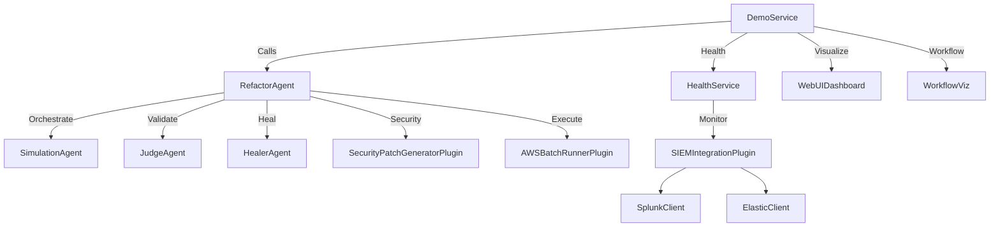

<!-- Copyright © 2025 Novatrax Labs LLC. All Rights Reserved. -->

# Proto Module - Self-Fixing Engineer (SFE) 🚀  
gRPC API v1.0.0 - The "Golden Contract" Edition  
**Proprietary Technology by Novatrax Labs**

Define robust gRPC APIs for SFE’s self-healing, refactoring, and governance workflows.

The Proto module provides gRPC service definitions for the Self-Fixing Engineer (SFE) platform, enabling secure, scalable, and cross-language communication for agent orchestration, refactoring, and health monitoring. Built with Protocol Buffers (protobuf), it defines DemoService for prototyping and Health for standard health checking, integrated with SFE’s cloud-native infrastructure (AWS, Azure, NATS) and agent crew (refactor_agent). With plugins for security, observability, and visualization, the module ensures enterprise-grade API contracts for refactoring, simulation, and governance.

Crafted with precision in Fairhope, Alabama, USA.  
Connect the SFE ecosystem with Proto’s golden API contracts.

---

## Table of Contents

- [Features](#features)
- [Architecture](#architecture)
- [Getting Started](#getting-started)
  - [Prerequisites](#prerequisites)
  - [Installation](#installation)
  - [Configuration](#configuration)
- [Usage](#usage)
  - [Generating Code](#generating-code)
  - [Running gRPC Services](#running-grpc-services)
  - [Health Checking](#health-checking)
  - [Monitoring and Logging](#monitoring-and-logging)
- [Extending Proto](#extending-proto)
  - [Adding Services](#adding-services)
  - [Integrating with Agents](#integrating-with-agents)
  - [Extending Plugins](#extending-plugins)
- [Key Components](#key-components)
- [Tests](#tests)
- [Troubleshooting](#troubleshooting)
- [Best Practices](#best-practices)
- [Contribution Guidelines](#contribution-guidelines)
- [Roadmap](#roadmap)
- [Support](#support)
- [License](#license)

---

## Features

The Proto module delivers robust gRPC APIs for SFE:

- **gRPC Service Definitions:**
  - DemoService: JSON-over-gRPC for prototyping (SayHello, ProcessData).
  - Health: Standard health checking (Check, Watch) per gRPC specification.
- **Cross-Language Support:**
  - Generates code for Go, Java, C#, and Python.
  - Versioned packages (`demo.v1`, `grpc.health.v1`) for compatibility.
- **Cloud-Native Integration:**
  - Ready for Google Cloud Endpoints, AWS App Mesh, and Azure API Management.
  - Integrates with NATS event bus (`refactor_agent.yaml`).
- **Observability:**
  - Logs API calls to SIEM platforms (`siem_integration_plugin.py`).
  - Exposes Prometheus and OpenTelemetry metrics.
- **Security:**
  - Enforces zero-trust policies via `SECURITY.md`.
  - Generates patches for vulnerabilities (`security_patch_generator_plugin.py`).
- **Visualization:**
  - Dashboards for API metrics (`web_ui_dashboard_plugin_template.py`).
  - Workflow visualizations (`workflow_viz.py`).
- **Extensibility:**
  - Add new `.proto` services for SFE agents.
  - Integrate with `refactor_agent` and plugins.

---

## Architecture

The Proto module defines gRPC APIs that integrate with SFE’s agent crew and plugins:



**Workflow:**
- API Access: Clients call DemoService for prototyping or Health for status checks.
- Agent Orchestration: `smart_refactor_agent.py` routes tasks to agents (judge, healer).
- Execution: Simulations run via `main_sim_runner.py` and `aws_batch_runner_plugin.py`.
- Observability: Logs to SIEM (`siem_integration_plugin.py`) and metrics to Prometheus.
- Visualization: Dashboards (`web_ui_dashboard_plugin_template.py`) and flowcharts (`workflow_viz.py`).

**Key Principles:**
- Interoperability: Cross-language gRPC APIs.
- Security: Zero-trust and provenance logging.
- Scalability: Cloud-native deployment.
- Extensibility: Pluggable services and plugins.

---

## Getting Started

### Prerequisites

- Python 3.8+, Go, Java, or C# (for code generation)
- `protoc`: Protocol Buffers compiler
- gRPC Tools: grpc-tools (Python), protoc-gen-go (Go), etc.
- Dependencies (in requirements.txt):
  - Core: grpcio, grpcio-tools, pyyaml, requests, prometheus_client, opentelemetry-sdk, boto3
  - Optional: fastapi, uvicorn, streamlit, plotly, networkx
- Configuration: `refactor_agent.yaml` for agent integration.
- Secrets: Set `OPENAI_API_KEY` and `REFRACTOR_AGENT_SECRET`.

### Installation

1. **Clone the Repository:**
    ```bash
    git clone <enterprise-repo-url>
    cd sfe/proto
    ```

2. **Set Up a Virtual Environment (for Python):**
    ```bash
    python -m venv .venv
    source .venv/bin/activate  # On Windows: .venv\Scripts\activate
    ```

3. **Install Dependencies:**
    ```bash
    pip install -r requirements.txt
    ```

**Example requirements.txt:**
```
grpcio>=1.46.0
grpcio-tools>=1.46.0
pyyaml>=5.4.1
requests>=2.28.0
prometheus_client>=0.14.0
opentelemetry-sdk>=1.12.0
boto3>=1.24.0
fastapi>=0.85.0
uvicorn>=0.18.0
streamlit>=1.12.0
plotly>=5.10.0
networkx>=2.8.0
```

4. **Install protoc:**
    - Download from protobuf releases.
    - Install language-specific plugins (e.g., protoc-gen-go, protoc-gen-grpc-java).

5. **Verify Setup:**
    ```bash
    protoc --version
    python -m grpc_tools.protoc --help
    ```

### Configuration

Use `refactor_agent.yaml` in `sfe/refactor_agent` for integration:
```yaml
integration:
  artifact_store: s3://your-bucket/artifacts/
  provenance_log: s3://your-bucket/audit_trail.log
  event_bus: nats://nats.your-domain.com/
observability:
  enable_prometheus: true
  metrics_report_path: metrics/
secrets:
  allowed_envs:
    - OPENAI_API_KEY
    - REFRACTOR_AGENT_SECRET
```

---

## Usage

### Generating Code

- **Generate Python code:**
    ```bash
    python -m grpc_tools.protoc -I. --python_out=. --grpc_python_out=. demo.proto health.proto
    ```
    - Output: `demo_pb2.py`, `demo_pb2_grpc.py`, `health_pb2.py`, `health_pb2_grpc.py`

- **Generate Go code:**
    ```bash
    protoc -I. --go_out=. --go-grpc_out=. demo.proto health.proto
    ```

- **Generate Java code:**
    ```bash
    protoc -I. --java_out=. --grpc-java_out=. demo.proto health.proto
    ```

### Running gRPC Services

- **Implement and run DemoService (Python example):**
    ```python
    # plugins/refactor/demo_service.py
    import grpc
    from concurrent import futures
    import demo_pb2
    import demo_pb2_grpc

    class DemoService(demo_pb2_grpc.DemoServiceServicer):
        def SayHello(self, request, context):
            name = json.loads(request.json_data).get("name", "World")
            return demo_pb2.HelloReply(message=f"Hello, {name}!")
        def ProcessData(self, request, context):
            return demo_pb2.DataReply(json_result=request.json_data)

    def serve():
        server = grpc.server(futures.ThreadPoolExecutor(max_workers=10))
        demo_pb2_grpc.add_DemoServiceServicer_to_server(DemoService(), server)
        server.add_insecure_port("[::]:50051")
        server.start()
        server.wait_for_termination()

    if __name__ == "__main__":
        serve()
    ```

- **Start the server:**
    ```bash
    python -m plugins.refactor.demo_service
    ```

### Health Checking

- **Check service health:**
    ```bash
    grpcurl -plaintext localhost:50051 grpc.health.v1.Health/Check
    ```
    - Output: `{"status": "SERVING"}`

- **Stream health updates:**
    ```bash
    grpcurl -plaintext localhost:50051 grpc.health.v1.Health/Watch
    ```

### Monitoring and Logging

- **Monitor metrics:**
    ```bash
    curl http://localhost:8001/metrics
    ```

- **Query SIEM logs:**
    ```bash
    python -m simulation.siem_integration_plugin query --query-string 'grpc_call' --siem-type splunk
    ```

- **Visualize workflows:**
    ```bash
    streamlit run workflow_viz.py
    ```

---

## Extending Proto

### Adding Services

- **Create a new .proto file (e.g., refactor.proto):**
    ```proto
    syntax = "proto3";
    package refactor.v1;
    service RefactorService {
        rpc RefactorCode (RefactorRequest) returns (RefactorReply) {}
    }
    message RefactorRequest {
        string code = 1;
    }
    message RefactorReply {
        string fixed_code = 1;
    }
    ```

- **Generate code and implement in plugins/refactor/.**

### Integrating with Agents

- **Update refactor_agent.yaml:**
    ```yaml
    agents:
      - id: refactor_service
        name: Refactor Service Agent
        manifest: plugins/refactor/refactor_manifest.json
        entrypoint: plugins/refactor/refactor_service.py
        agent_type: plugin
    ```
- **Implement refactor_service.py to call RefactorService.**

### Extending Plugins

- **Create a plugin in plugins/custom/:**
    ```python
    def custom_grpc_hook(params: Dict[str, Any]) -> Dict[str, Any]:
        return {"status": "success", "result": "Processed gRPC call"}

    def register_plugin_entrypoints(plugin_manager):
        plugin_manager.register_hook("on_grpc_call", custom_grpc_hook)
    ```

- **Update refactor_agent.yaml:**
    ```yaml
    integration:
      plugin_registry: s3://your-bucket/plugins/
    ```

---

## Key Components

| File/Component           | Purpose                                      |
|--------------------------|----------------------------------------------|
| demo.proto               | Defines DemoService for JSON-over-gRPC prototyping |
| health.proto             | Implements gRPC health-checking service      |

**Related Modules:**
- refactor_agent.yaml: Defines agent crew for orchestration

**Plugins (from simulation/plugins):**
- security_patch_generator_plugin.py: Generates AI-driven patches for API code
- siem_integration_plugin.py: Logs gRPC calls to SIEM platforms
- workflow_viz.py: Visualizes API workflows
- web_ui_dashboard_plugin_template.py: Provides dashboards for API metrics
- aws_batch_runner_plugin.py: Executes gRPC tasks in AWS Batch

**Artifacts:**
- `*.pb2.py`, `*.pb2_grpc.py`: Generated Python code
- `s3://your-bucket/artifacts/`: API outputs
- `s3://your-bucket/audit_trail.log`: Provenance logs

---

## Tests

**tests/test_demo_service.py (Assumed)**

- Coverage:
  - SayHello and ProcessData functionality
  - JSON validation and error handling
- Gaps:
  - Edge-case testing for malformed JSON

**tests/test_health_service.py (Assumed)**

- Coverage:
  - Check and Watch endpoints
  - Status transitions (SERVING, NOT_SERVING)
- Gaps:
  - Load testing for Watch streams

**Run Tests:**
```bash
pytest --cov=plugins.refactor --cov-report=html
```
- Output: Coverage report in `htmlcov/index.html` (target: 90%+)

---

## Troubleshooting

- **protoc Errors:**  
  Ensure protoc is installed: `protoc --version`  
  Verify plugin paths in demo.proto and health.proto

- **gRPC Service Failures:**  
  Check logs: `python -m simulation.siem_integration_plugin query --siem-type splunk`  
  Run health check:  
    ```bash
    grpcurl -plaintext localhost:50051 grpc.health.v1.Health/Check
    ```

- **Plugin Issues:**  
  Verify manifests in `plugins/*/manifest.json`  
  Run `python -m simulation.siem_integration_plugin health`

- **Visualization Errors:**  
  Ensure streamlit and plotly are installed  
  Run `streamlit run workflow_viz.py -- --debug`

---

## Best Practices

- Version APIs: Use `demo.v1` and reserved fields for compatibility
- Secure Services: Enable TLS and authentication for gRPC
- Monitor Health: Use Health service for load balancer integration
- Log Proactively: Configure `siem_integration_plugin.py` for all API calls
- Test Rigorously: Include edge cases in `tests/test_demo_service.py`

---

## Contribution Guidelines

- **Proto Style:** Follow gRPC and protobuf best practices
- **Testing:** Add tests for new services in `tests/`
- **Documentation:** Update `.proto` files with detailed comments
- **Pull Requests:** Ensure `pytest --cov=plugins` achieves 90%+ coverage

---

## Roadmap

- SFE-Specific Services: Add RefactorService for code fixes
- Enhanced Security: Integrate `security_patch_generator_plugin.py` for proto validation
- Dynamic Agents: Implement runtime-resolved agent entrypoints
- Advanced Visualizations: Enhance `workflow_viz.py` for gRPC workflows

---

## Support

Contact Novatrax Labs’ support at **support@novatraxlabs.com**  
File issues at `<enterprise-repo-url>/issues` (enterprise access required)

---

## License

**Proprietary and Confidential © 2025 Novatrax Labs. All rights reserved.**

Proto Module and Self-Fixing Engineer™ are proprietary technologies.  
Unauthorized copying, distribution, reverse engineering, or use is strictly prohibited.  
For commercial licensing or evaluation inquiries, contact **support@novatraxlabs.com**.

Connect SFE with Proto’s robust gRPC APIs.