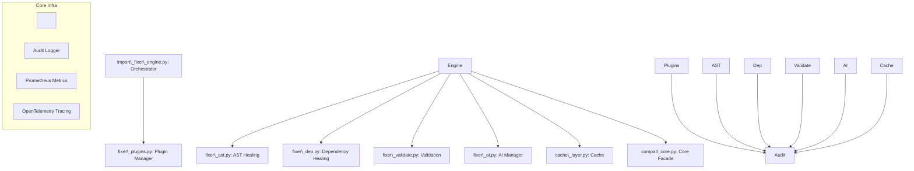

\# Appendix: Import Fixer Submodule — Patent, Compliance, and Technical Disclosure

\## 1. Overview

The `self\_healing\_import\_fixer/import\_fixer/` module provides a production-grade, enterprise-safe, and compliance-focused system for atomic healing and validation of Python import/call dependencies. It is designed for regulated environments, CI/CD, developer IDEs, and as an embeddable automated service. All critical operations are logged, auditable, and revertible, with plugin-driven extensibility, AI-powered healing, and security features for operator and system safety.

---

\# Appendix: Import Fixer Submodule — Patent, Compliance, and Technical Disclosure

\## 1. Overview

The `self\_healing\_import\_fixer/import\_fixer/` module provides a production-grade, enterprise-safe, and compliance-focused system for atomic healing and validation of Python import/call dependencies. It is designed for regulated environments, CI/CD, developer IDEs, and as an embeddable automated service. All critical operations are logged, auditable, and revertible, with plugin-driven extensibility, AI-powered healing, and security features for operator and system safety.

---

\## 2. File/Subsystem Inventory

| File/Subsystem         | Purpose / Innovations                                                                                   |

|------------------------|--------------------------------------------------------------------------------------------------------|

| cache\_layer.py         | Unified, resilient cache abstraction (Redis, file, memory) with telemetry, metrics, audit, and fallback|

| compat\_core.py         | Secure, compliant core facade for infra: alerting, secrets, audit, metrics, tracing, fallback          |

| fixer\_ai.py            | AI-powered refactoring and healing, prompt sanitization, token quota, caching, audit                   |

| fixer\_ast.py           | AST-based healing: cycle breaking, dynamic import refactoring, AI fallback, path whitelisting          |

| fixer\_dep.py           | Dependency healing: atomic pyproject.toml/requirements.txt repair, whitelisted writes, audit           |

| fixer\_plugins.py       | Dynamic, signature-verified plugin manager for healers/validators/hooks, with security controls        |

| fixer\_validate.py      | Full validation pipeline: compile, lint, type, static analysis, tests, atomic commit/rollback, audit   |

| import\_fixer\_engine.py | End-to-end orchestration for healing process, safe import of submodules, test/CI friendly              |

| \\\_\\\_init\\\_\\\_.py        | Package initializer                                                                                    |

| README.md              | Documentation, usage, compliance summary                                                               |

---

\## 3. Technical Innovations

\### 3.1. Secure, Tamper-Evident Plugin System

\- \*\*HMAC-Signed Plugins:\*\*  

&nbsp; Only plugins with operator-approved HMAC signatures and whitelisted paths are loaded in production.  

\- \*\*Dynamic Registration, Strict Controls:\*\*  

&nbsp; Runtime plugin registration is forbidden in production; only pre-registered, signed plugins in approved directories are allowed.

\### 3.2. AI-Driven and Mechanical Healing

\- \*\*AST-Based Healing:\*\*  

&nbsp; Automatically fixes circular dependencies by moving imports, refactoring modules, or consulting AI for advanced cycles.

\- \*\*AI-Powered Suggestions:\*\*  

&nbsp; LLM-based suggestions and patches, with prompt/output sanitization, quota/rate limiting, and audit. No auto-apply in production.

\### 3.3. Atomic, Auditable Dependency and File Healing

\- \*\*Atomic Changes with Full Audit:\*\*  

&nbsp; All file changes (pyproject.toml, requirements.txt, source files) are atomic, with rollback, backup, and full audit logging.

\- \*\*Diffs and Interactive Approval:\*\*  

&nbsp; All diffs are shown and require operator approval (forbidden in production, allowed in dev), with audit trails.

\### 3.4. Compliance, Security, and Operator Safety

\- \*\*Path Whitelisting and Validation:\*\*  

&nbsp; All file and directory operations require explicit whitelisting. Path traversal, symlinks, and cross-boundary writes are forbidden.

\- \*\*Tamper-Evident Audit Trail:\*\*  

&nbsp; All major operations (healing, plugin load, AI call, validation) are audit-logged with HMAC signing and S3 backup.

\- \*\*Fallbacks with Alerting:\*\*  

&nbsp; If Redis or other infrastructure is unavailable, the system falls back to safe modes, emits operator alerts, and degrades gracefully.

\### 3.5. Full Validation Pipeline

\- \*\*Compilation, Lint, Type, Security, Test:\*\*  

&nbsp; Every change is validated via compilation, linter (ruff/flake8), type check (mypy), static analysis (bandit), and tests (pytest).

\- \*\*Batch and Single-File Modes:\*\*  

&nbsp; Supports atomic, auditable validation of single or multiple files, with rollback on any failure.

\### 3.6. Resilient Caching

\- \*\*Multi-Layered Cache (Redis, File, Memory):\*\*  

&nbsp; All cache layers are instrumented for metrics, audit, and fallback, with HMAC for file cache integrity and alerts for persistent failure.

---

\## 4. Security and Compliance Claims

\- \*\*Operator Approval and Audit:\*\*  

&nbsp; All healing and plugin registration in production require explicit operator approval and full audit.

\- \*\*No Unapproved Plugins in Production:\*\*  

&nbsp; Only HMAC-signed, whitelisted plugins are permitted; runtime registration is forbidden.

\- \*\*Atomic, Auditable, and Revertible:\*\*  

&nbsp; Every file operation is atomic, logged, and revertible; backups are made before any change.

\- \*\*Prompt Injection and Secret Scrubbing:\*\*  

&nbsp; All AI prompts and responses are sanitized for prompt injection and secret leaks.

\- \*\*Metrics and Tracing:\*\*  

&nbsp; All operations are metered and traced for compliance, with safe fallbacks if dependencies are missing.

---

\## 5. Core Architecture

---

\## 6. Example Use Cases

\- \*\*CI/CD Automated Healing:\*\*  

&nbsp; Run `import\_fixer\_engine.py` with a signed config to automatically heal, validate, and audit Python projects before deployment.  

\- \*\*Regulated Environment (PCI/SOX/HIPAA):\*\*  

&nbsp; All changes, plugin loads, and AI calls are fully logged, signed, and offloaded to S3, supporting compliance.

\- \*\*Operator-Approved AI Refactoring:\*\*  

&nbsp; AI suggestions are only applied after operator review in non-production; full audit trail is created.

---

\## 7. Expanded Inventive Concepts

1\. \*\*HMAC-signed, tamper-evident plugin system with path whitelisting and runtime controls.\*\*

2\. \*\*Atomic, auditable AST-based healing with AI fallback and rollback support.\*\*

3\. \*\*Secure, multi-layered cache with fallback, metrics, and audit, including HMAC-signed file cache.\*\*

4\. \*\*Comprehensive validation pipeline with full rollback, audit, and operator approval.\*\*

5\. \*\*Prompt injection and output sanitization for all AI-powered healing.\*\*

6\. \*\*Production-mode enforcement: forbids auto-apply, runtime plugin registration, and non-audited changes.\*\*

---

\## 8. Example Patent Claims

1\. \*\*A method for atomic, auditable codebase healing with plugin-driven, HMAC-verified extensibility, comprising: ...\*\*

2\. \*\*A system for secure, tamper-evident plugin verification and whitelisted dynamic loading in a code healing engine, comprising: ...\*\*

3\. \*\*A method for AI-powered code healing with prompt/output sanitization, quota enforcement, and operator approval, comprising: ...\*\*

4\. \*\*A system for atomic, auditable dependency file healing with rollback, diff approval, and full validation, comprising: ...\*\*

5\. \*\*A cache abstraction with prioritized backends (Redis, file, memory), metrics, and HMAC-signed file entries for code healing operations, comprising: ...\*\*

---

\## 9. File/Subsystem Descriptions

\### cache\_layer.py

\- \*\*Unified cache abstraction\*\*: selects Redis, file, or memory backend at runtime.

\- \*\*All operations traced/metricized\*\*: Prometheus and OpenTelemetry.

\- \*\*File cache integrity\*\*: HMAC-signed JSON blobs for tamper-evidence.

\- \*\*Fallback and alerting\*\*: Operator is alerted on persistent failures or fallback events.

\### compat\_core.py

\- \*\*Core infrastructure facade\*\*: centralizes alerting, secrets, audit, metrics, tracing.

\- \*\*Resilient initialization\*\*: retries, fallbacks, strict production/development separation.

\- \*\*Audit log offloading\*\*: S3 rotation and lifecycle for audit retention.

\### fixer\_plugins.py

\- \*\*Plugin manager\*\*: dynamic, HMAC-verified plugin loading from whitelisted dirs.

\- \*\*Strict production controls\*\*: no runtime registration, only pre-approved plugins.

\- \*\*Audit logging for all plugin actions\*\*.

\### fixer\_ai.py

\- \*\*AI manager\*\*: all suggestions/patches go through prompt sanitization, quota/rate limiting, and audit.

\- \*\*No auto-apply in production\*\*: suggestions are reviewed, applied only with operator approval.

\- \*\*All cache and infra failures logged and alerted\*\*.

\### fixer\_ast.py

\- \*\*AST-based code healing\*\*: finds and fixes cycles, dynamic imports, with AI fallback.

\- \*\*Path whitelisting\*\*: aborts on any operation outside safe dirs.

\- \*\*All changes are auditable and revertible\*\*.

\### fixer\_dep.py

\- \*\*Dependency file healing\*\*: atomic update of pyproject.toml/requirements.txt, backup/rollback.

\- \*\*Detects missing/unused deps\*\*: generates and audits diffs.

\- \*\*Interactive diff approval\*\*: operator must approve changes (forbidden in production).

\### fixer\_validate.py

\- \*\*Validation pipeline\*\*: compile, lint, type, static, test, with atomic commit/rollback.

\- \*\*Batch and single-file support\*\*: with full audit and operator controls.

\- \*\*Custom validator hooks\*\*: plugin-driven extension.

\### import\_fixer\_engine.py

\- \*\*End-to-end orchestrator\*\*: runs all healing/validation steps safely and in correct order.

\- \*\*Test and CI/CD friendly\*\*: can be called standalone or as part of a larger system.

---

\## 10. Compliance Summary

\- \*\*PCI DSS, SOX, HIPAA, GDPR\*\*: Tamper-evident audit, secrets scrubbing, and operator approval flows.

\- \*\*No unapproved code in production\*\*: All code changes, plugin loads, and AI calls are audited, signed, and revertible.

\- \*\*Continuous health and fallback monitoring\*\*: Operator is alerted on any failure, fallback, or compliance risk.

---

\## 11. End of Appendix

This document is intended for legal counsel, patent lawyers, compliance reviewers, and technical leads. It explicitly covers all inventive concepts, security/compliance claims, and the unique features of the `self\_healing\_import\_fixer/import\_fixer/` submodule as implemented.

\## 2. File/Subsystem Inventory

| File/Subsystem         | Purpose / Innovations                                                                                   |

|------------------------|--------------------------------------------------------------------------------------------------------|

| cache\_layer.py         | Unified, resilient cache abstraction (Redis, file, memory) with telemetry, metrics, audit, and fallback|

| compat\_core.py         | Secure, compliant core facade for infra: alerting, secrets, audit, metrics, tracing, fallback          |

| fixer\_ai.py            | AI-powered refactoring and healing, prompt sanitization, token quota, caching, audit                   |

| fixer\_ast.py           | AST-based healing: cycle breaking, dynamic import refactoring, AI fallback, path whitelisting          |

| fixer\_dep.py           | Dependency healing: atomic pyproject.toml/requirements.txt repair, whitelisted writes, audit           |

| fixer\_plugins.py       | Dynamic, signature-verified plugin manager for healers/validators/hooks, with security controls        |

| fixer\_validate.py      | Full validation pipeline: compile, lint, type, static analysis, tests, atomic commit/rollback, audit   |

| import\_fixer\_engine.py | End-to-end orchestration for healing process, safe import of submodules, test/CI friendly              |

| \\\_\\\_init\\\_\\\_.py        | Package initializer                                                                                    |

| README.md              | Documentation, usage, compliance summary                                                               |

---

\## 3. Technical Innovations

\### 3.1. Secure, Tamper-Evident Plugin System

\- \*\*HMAC-Signed Plugins:\*\*  

&nbsp; Only plugins with operator-approved HMAC signatures and whitelisted paths are loaded in production.  

\- \*\*Dynamic Registration, Strict Controls:\*\*  

&nbsp; Runtime plugin registration is forbidden in production; only pre-registered, signed plugins in approved directories are allowed.

\### 3.2. AI-Driven and Mechanical Healing

\- \*\*AST-Based Healing:\*\*  

&nbsp; Automatically fixes circular dependencies by moving imports, refactoring modules, or consulting AI for advanced cycles.

\- \*\*AI-Powered Suggestions:\*\*  

&nbsp; LLM-based suggestions and patches, with prompt/output sanitization, quota/rate limiting, and audit. No auto-apply in production.

\### 3.3. Atomic, Auditable Dependency and File Healing

\- \*\*Atomic Changes with Full Audit:\*\*  

&nbsp; All file changes (pyproject.toml, requirements.txt, source files) are atomic, with rollback, backup, and full audit logging.

\- \*\*Diffs and Interactive Approval:\*\*  

&nbsp; All diffs are shown and require operator approval (forbidden in production, allowed in dev), with audit trails.

\### 3.4. Compliance, Security, and Operator Safety

\- \*\*Path Whitelisting and Validation:\*\*  

&nbsp; All file and directory operations require explicit whitelisting. Path traversal, symlinks, and cross-boundary writes are forbidden.

\- \*\*Tamper-Evident Audit Trail:\*\*  

&nbsp; All major operations (healing, plugin load, AI call, validation) are audit-logged with HMAC signing and S3 backup.

\- \*\*Fallbacks with Alerting:\*\*  

&nbsp; If Redis or other infrastructure is unavailable, the system falls back to safe modes, emits operator alerts, and degrades gracefully.

\### 3.5. Full Validation Pipeline

\- \*\*Compilation, Lint, Type, Security, Test:\*\*  

&nbsp; Every change is validated via compilation, linter (ruff/flake8), type check (mypy), static analysis (bandit), and tests (pytest).

\- \*\*Batch and Single-File Modes:\*\*  

&nbsp; Supports atomic, auditable validation of single or multiple files, with rollback on any failure.

\### 3.6. Resilient Caching

\- \*\*Multi-Layered Cache (Redis, File, Memory):\*\*  

&nbsp; All cache layers are instrumented for metrics, audit, and fallback, with HMAC for file cache integrity and alerts for persistent failure.

---

\## 4. Security and Compliance Claims

\- \*\*Operator Approval and Audit:\*\*  

&nbsp; All healing and plugin registration in production require explicit operator approval and full audit.

\- \*\*No Unapproved Plugins in Production:\*\*  

&nbsp; Only HMAC-signed, whitelisted plugins are permitted; runtime registration is forbidden.

\- \*\*Atomic, Auditable, and Revertible:\*\*  

&nbsp; Every file operation is atomic, logged, and revertible; backups are made before any change.

\- \*\*Prompt Injection and Secret Scrubbing:\*\*  

&nbsp; All AI prompts and responses are sanitized for prompt injection and secret leaks.

\- \*\*Metrics and Tracing:\*\*  

&nbsp; All operations are metered and traced for compliance, with safe fallbacks if dependencies are missing.

---

\## 5. Core Architecture

---

\## 6. Example Use Cases

\- \*\*CI/CD Automated Healing:\*\*  

&nbsp; Run `import\_fixer\_engine.py` with a signed config to automatically heal, validate, and audit Python projects before deployment.  

\- \*\*Regulated Environment (PCI/SOX/HIPAA):\*\*  

&nbsp; All changes, plugin loads, and AI calls are fully logged, signed, and offloaded to S3, supporting compliance.

\- \*\*Operator-Approved AI Refactoring:\*\*  

&nbsp; AI suggestions are only applied after operator review in non-production; full audit trail is created.

---

\## 7. Expanded Inventive Concepts

1\. \*\*HMAC-signed, tamper-evident plugin system with path whitelisting and runtime controls.\*\*

2\. \*\*Atomic, auditable AST-based healing with AI fallback and rollback support.\*\*

3\. \*\*Secure, multi-layered cache with fallback, metrics, and audit, including HMAC-signed file cache.\*\*

4\. \*\*Comprehensive validation pipeline with full rollback, audit, and operator approval.\*\*

5\. \*\*Prompt injection and output sanitization for all AI-powered healing.\*\*

6\. \*\*Production-mode enforcement: forbids auto-apply, runtime plugin registration, and non-audited changes.\*\*

---

\## 8. Example Patent Claims

1\. \*\*A method for atomic, auditable codebase healing with plugin-driven, HMAC-verified extensibility, comprising: ...\*\*

2\. \*\*A system for secure, tamper-evident plugin verification and whitelisted dynamic loading in a code healing engine, comprising: ...\*\*

3\. \*\*A method for AI-powered code healing with prompt/output sanitization, quota enforcement, and operator approval, comprising: ...\*\*

4\. \*\*A system for atomic, auditable dependency file healing with rollback, diff approval, and full validation, comprising: ...\*\*

5\. \*\*A cache abstraction with prioritized backends (Redis, file, memory), metrics, and HMAC-signed file entries for code healing operations, comprising: ...\*\*

---

\## 9. File/Subsystem Descriptions

\### cache\_layer.py

\- \*\*Unified cache abstraction\*\*: selects Redis, file, or memory backend at runtime.

\- \*\*All operations traced/metricized\*\*: Prometheus and OpenTelemetry.

\- \*\*File cache integrity\*\*: HMAC-signed JSON blobs for tamper-evidence.

\- \*\*Fallback and alerting\*\*: Operator is alerted on persistent failures or fallback events.

\### compat\_core.py

\- \*\*Core infrastructure facade\*\*: centralizes alerting, secrets, audit, metrics, tracing.

\- \*\*Resilient initialization\*\*: retries, fallbacks, strict production/development separation.

\- \*\*Audit log offloading\*\*: S3 rotation and lifecycle for audit retention.

\### fixer\_plugins.py

\- \*\*Plugin manager\*\*: dynamic, HMAC-verified plugin loading from whitelisted dirs.

\- \*\*Strict production controls\*\*: no runtime registration, only pre-approved plugins.

\- \*\*Audit logging for all plugin actions\*\*.

\### fixer\_ai.py

\- \*\*AI manager\*\*: all suggestions/patches go through prompt sanitization, quota/rate limiting, and audit.

\- \*\*No auto-apply in production\*\*: suggestions are reviewed, applied only with operator approval.

\- \*\*All cache and infra failures logged and alerted\*\*.

\### fixer\_ast.py

\- \*\*AST-based code healing\*\*: finds and fixes cycles, dynamic imports, with AI fallback.

\- \*\*Path whitelisting\*\*: aborts on any operation outside safe dirs.

\- \*\*All changes are auditable and revertible\*\*.

\### fixer\_dep.py

\- \*\*Dependency file healing\*\*: atomic update of pyproject.toml/requirements.txt, backup/rollback.

\- \*\*Detects missing/unused deps\*\*: generates and audits diffs.

\- \*\*Interactive diff approval\*\*: operator must approve changes (forbidden in production).

\### fixer\_validate.py

\- \*\*Validation pipeline\*\*: compile, lint, type, static, test, with atomic commit/rollback.

\- \*\*Batch and single-file support\*\*: with full audit and operator controls.

\- \*\*Custom validator hooks\*\*: plugin-driven extension.

\### import\_fixer\_engine.py

\- \*\*End-to-end orchestrator\*\*: runs all healing/validation steps safely and in correct order.

\- \*\*Test and CI/CD friendly\*\*: can be called standalone or as part of a larger system.

---

\## 10. Compliance Summary

\- \*\*PCI DSS, SOX, HIPAA, GDPR\*\*: Tamper-evident audit, secrets scrubbing, and operator approval flows.

\- \*\*No unapproved code in production\*\*: All code changes, plugin loads, and AI calls are audited, signed, and revertible.

\- \*\*Continuous health and fallback monitoring\*\*: Operator is alerted on any failure, fallback, or compliance risk.

---

\## 11. End of Appendix

This document is intended for legal counsel, patent lawyers, compliance reviewers, and technical leads. It explicitly covers all inventive concepts, security/compliance claims, and the unique features of the `self\_healing\_import\_fixer/import\_fixer/` submodule as implemented.

